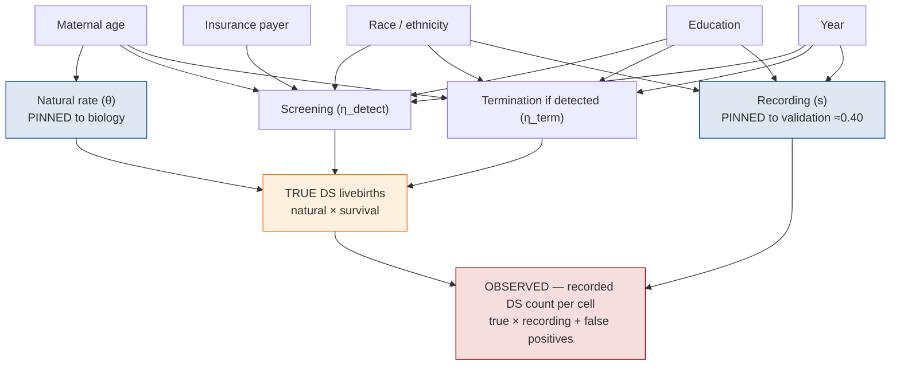
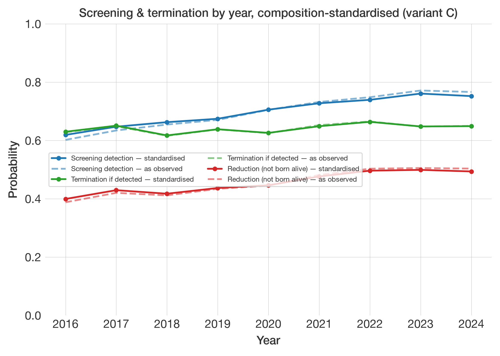
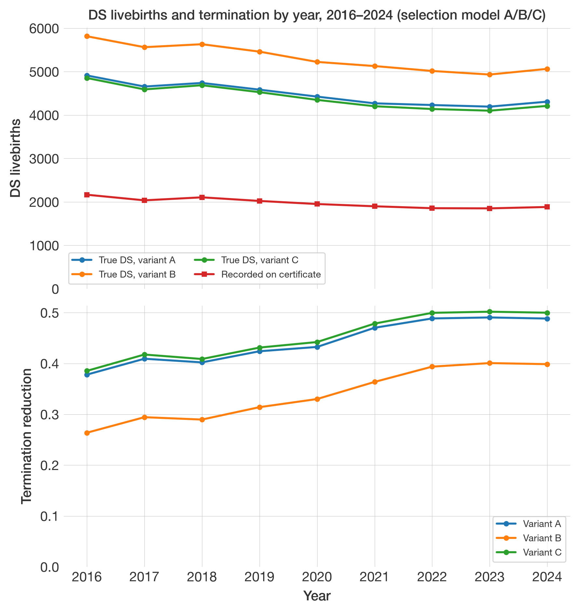
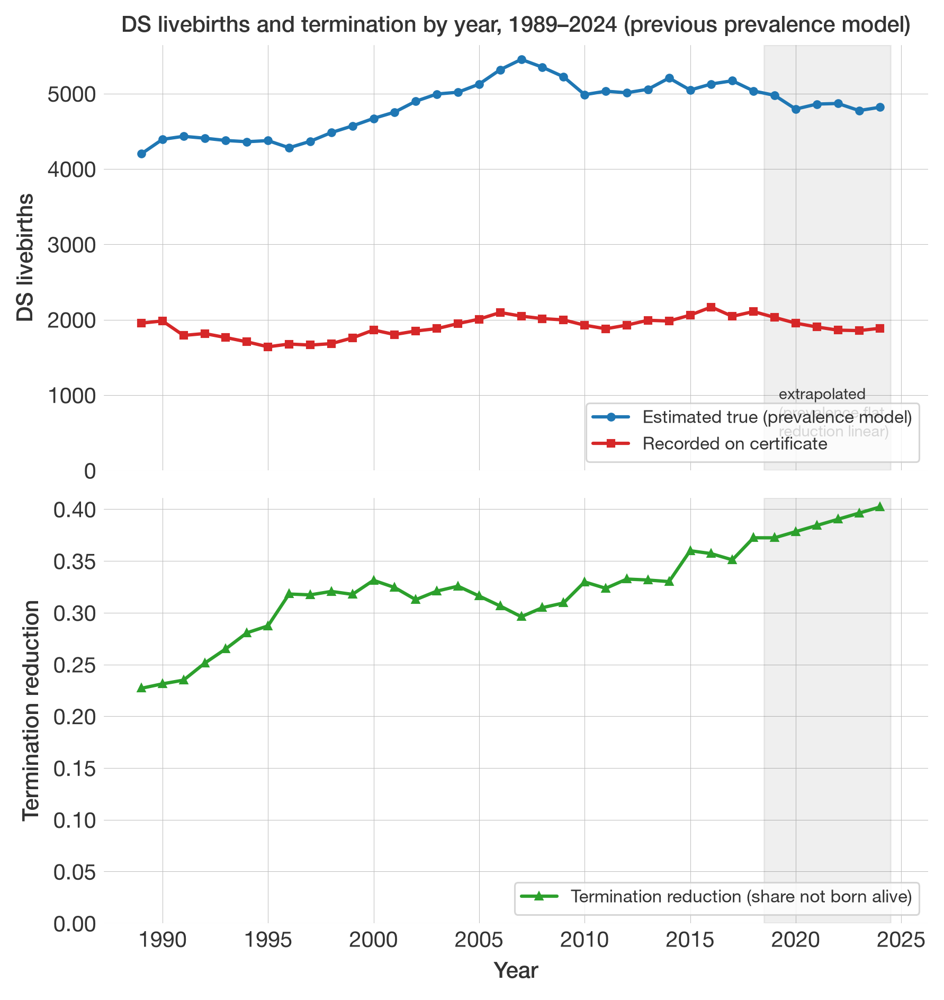
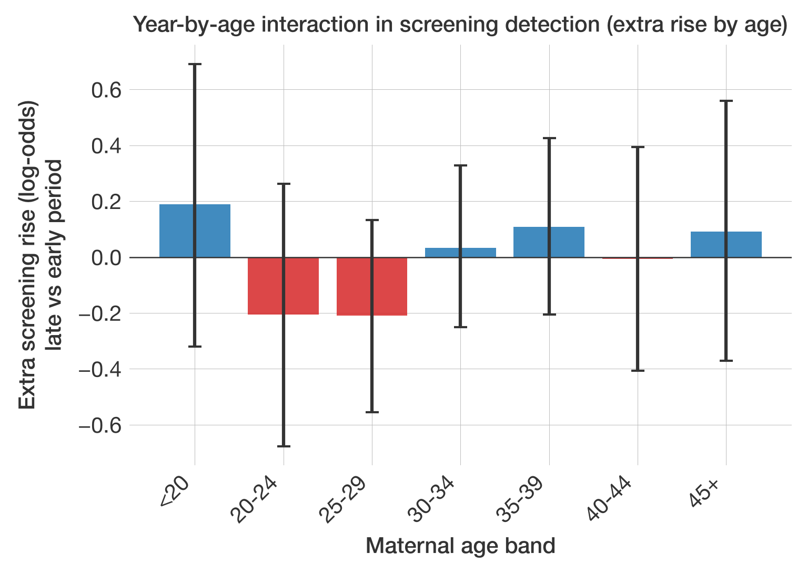
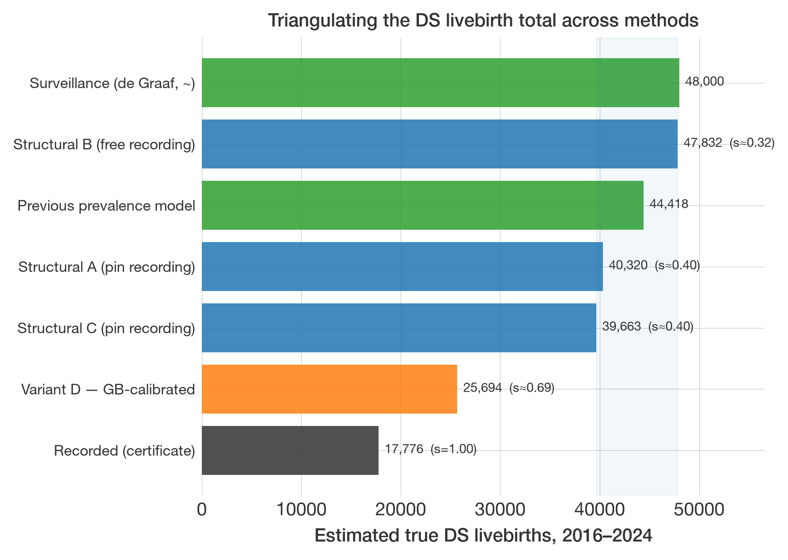

# Estimating Down syndrome births from US birth certificates: a Bayesian selection model and its predictors

> [!WARNING]
> This note was drafted by an AI coding assistant.

**Date:** 2026-06-22
**Status:** preliminary. Numbers are from the publication-quality ("reporting")
fits — 4 chains, 1,500+1,500 draws, all three variants converged. Figures remain
provisional.

---

## The model

The data are simple: we group all 33.5 M births into demographic **cells** — one per
combination of maternal-age band, race/ethnicity, education, insurance payer and
year — and, in each cell, count how many births were _recorded_ as DS. That count is
modelled as a **binomial** draw: `N` births in the cell, each with some probability
of showing up as a recorded DS case. We estimate that probability by splitting it
into three stages, each itself a probability:

1. **Natural rate (θ).** Of all births to mothers of a given age, what fraction
   would be DS livebirths _if no-one screened or terminated_? This is biology,
   rising steeply with maternal age (about 1 in 1,500 under age 20, about 1 in 33 at
   age 45+). It is well measured by earlier studies (Morris et al.), so we **pin** it.
2. **Survival (η).** Not every DS pregnancy is born: some are detected by prenatal
   screening and the pregnancy electively terminated. _Survival_ is the fraction that
   reach a live birth. It is itself the product of two sub-steps — **screening**
   (does prenatal screening detect the case?) and **termination** (given detection,
   is the pregnancy ended?) — so `survival = 1 − screening × termination`, and the
   complement, `1 − survival`, is the "reduction" (the share not born alive).
3. **Recording (s).** Given a DS baby _is_ born, does the certificate record it?
   Validation studies put this around 0.40 — i.e. ~60% are missed — so we **pin** it
   too.

Put together, the chance a given birth shows up as a _recorded_ DS case is roughly

```
recorded rate ≈ natural × survival × recording   (θ × η × s; plus a tiny false-positive rate)
```

and the **true** number of DS livebirths is `natural × survival` (θ × η) summed over
all births. Each
stage is allowed to depend on the cell's covariates — age, race, education, payer,
year — which is how we can later read off, say, termination by education. The
generative structure is:



## Bayesian posterior distributions

In a frequentist analysis you'd maximise a **likelihood** — the probability of the
data given the parameters — and report point estimates with confidence intervals.
We use the same likelihood (here, a binomial count of recorded DS in each
demographic "cell"), but we also attach a **prior** to each parameter: a
distribution that encodes what earlier studies already tell us (e.g. "s is about
0.40"). Multiplying prior × likelihood and renormalising gives the **posterior** —
the updated distribution of each parameter given both the data _and_ the outside
knowledge. A **95% credible interval** is then read directly as "95% probability
the parameter lies here" (conditional on the model and priors).

Why bother? Because — as the next section shows — the data alone _cannot_ pin down
all the parameters. The external knowledge in the priors is doing essential work.
That is a strength (it lets us use everything we know) and a liability (the answer
leans on assumptions), and being explicit about it is the whole point.

## The hard part: things that only ever appear multiplied together

Look again at `recorded rate ≈ θ × η × s`. The data only ever see the **product**.
That means the data cannot, by themselves, tell apart:

- _"few DS babies, but well recorded"_ (low η, high s), from
- _"many DS babies, but poorly recorded"_ (high η, low s).

Both give the same recorded counts. This is called **non-identifiability**. The
closest frequentist analogue is **perfect multicollinearity** in a regression: when
two predictors move together, you can estimate their combined effect but not their
separate coefficients. Here, η and s (and, it turns out, θ) are tangled the same
way. The data fix the product; _something else_ has to fix the split.

That "something else" is the priors — i.e. external numbers we pin down. The total
DS estimate therefore depends not just on the data but on **which external numbers
we trust and how hard we pin them**. Keep this in mind; it's the main caveat.

## What went wrong the first time (and what it taught us)

Our first runs produced a nonsense answer: about **226,000** true DS livebirths
over 2016–2024 — roughly **five times** the figure independent surveillance implies
(~45,000). Worse, three model variants that should have disagreed if the answer
were prior-driven all gave the _same_ inflated number, which initially looked
reassuring but was actually all three sharing one fault.

The fault: the "natural rate" θ — which we _thought_ was nailed down by biology —
quietly drifted to **3–4× its known value**. We had given it a "tight" prior
(a standard deviation of 0.10 on the log-odds scale), but with **33.5 million**
data points the likelihood is so overwhelmingly strong that a 0.10 prior behaves
like a loose suggestion, not a constraint. The data dragged θ 11–15 standard
deviations away from its prior — something that should be astronomically unlikely,
and only happens because the prior was, in effect, far weaker than it looked.

_Why_ did θ drift? Because the recorded-DS pattern across maternal age didn't match
what the model could otherwise produce. Older mothers screen and terminate far
more, so their _recorded_ DS rate, relative to the natural rate, is much lower than
younger mothers'. The model had no way to express "termination rises steeply with
age" (that age effect was missing from η), so the only knob it could turn to fit
the age pattern was θ itself — and it turned it, breaking the biology.

**Lesson:** at this data scale, "informative prior" is not the same as "fixed
number". Anything you mean to hold fixed has to be pinned _hard_.

### What we changed

Four changes, all aimed at putting each effect where it belongs and pinning the
genuinely-external quantities so the data can't overwrite them:

1. **Pinned θ hard** (standard deviation 0.10 → 0.001). θ is now held at the
   biological values; it can no longer absorb other effects.
2. **Put maternal age where the biology says it acts.** Age now enters three
   places: the natural rate θ (conception — already there), **screening access**
   (older mothers reach screening more), and **termination choice** (it varies with
   age). The steep age pattern now lands in η — the screening/termination stage —
   instead of corrupting θ.
3. **Pinned the recording rate s hard too** (it was escaping the same way θ did),
   at the validation value ~0.40.
4. **Dropped "clinical flags" from the recording stage.** We had let conditions
   like congenital heart defect (CCHD) and NICU admission influence the _recording_
   probability. They misbehaved badly — the model decided NICU babies are recorded
   almost perfectly — because those conditions are actually signs the baby _is_ DS
   (CCHD is caused by DS about half the time), not signs of better paperwork. The
   model wasn't allowed to say "more true DS here", so it said "better recording
   here" instead. Removing them stops the distortion. (They're kept for a separate
   analysis of co-occurring conditions, where they belong as _outcomes_ of DS.)

We also refreshed the screening numbers for the modern era: prenatal screening
shifted from older blood tests to **cell-free DNA (NIPT)** between roughly 2013 and
2022, which sharply raised detection (and so termination) — a literature review
documents this and feeds the age/year structure of η.

## Current results (preliminary)

With those fixes the model converges (r̂ ≤ 1.01 across all three variants, with
healthy effective sample sizes). The two variants that **pin** the recording rate
(A, C) agree tightly at ~40,000; the variant that instead **frees** recording (B)
lands at ~48,000. That spread is now an honest sensitivity range, not a shared fault:

| quantity                      | estimate (2016–2024)                                                                | interpretation                                                   |
| ----------------------------- | ----------------------------------------------------------------------------------- | ---------------------------------------------------------------- |
| **True DS livebirths**        | **~40,000** (pin recording ≈0.40) **to ~48,000** (let the data set recording ≈0.32) | recorded + missed; the range _is_ the recording-assumption bound |
| Recorded (data)               | 17,776 (~15,200 after removing estimated false positives)                           | what the certificates caught                                     |
| **Implied missed**            | **~25,000–33,000 (≈62–68%)**                                                        | true babies the certificates didn't record                       |
| Recording rate `s`            | 0.38 (pinned) → 0.32 (data-preferred, variant B)                                    | fraction of true DS recorded                                     |
| Termination reduction `1 − η` | ~34–45% overall; age-graded ~5% (under 20) → ~64% (45+)                             | share of DS pregnancies electively terminated                    |

Read it as a funnel: absent screening, roughly **72,000** DS babies would have been
born (this baseline is fixed by the pinned biology). Depending on the recording
assumption, **34–45%** of those pregnancies were electively terminated, leaving
**~40,000–48,000** born; of those, only **~32–38%** were recorded, leaving
**~25,000–33,000 missed**. The model also reproduces the recorded counts age-band
by age-band (a "posterior-predictive check") to within about 5%.


**Why three variants (A, B, C).** The data fix the product
`natural × survival × recording`; they cannot split survival (termination) from
recording. The priors break that tie, and the three variants probe _how_ — on the
one axis where it bites: the tightness of the **race/education coefficients** in
recording (`s`) versus termination (`η_term`). When a group's recorded DS rate is
low, is it _recorded less_ or _terminated more_? The variants tilt the answer:

| variant                | recording demographics | termination demographics | gaps load onto | total |
| ---------------------- | ---------------------- | ------------------------ | -------------- | ----- |
| **C** (main spec)      | moderately pinned      | moderately free          | balanced       | ~40k  |
| **A** (tight `s`)      | pinned harder          | freer                    | termination    | ~40k  |
| **B** (tight `η_term`) | freer                  | pinned harder            | recording      | ~48k  |

θ, the baseline recording (~0.40 for the reference group) and the screening curve
are pinned _identically_ in all three — only the demographic _allocation_ moves. B
reaches ~48k because freeing recording lets the data pull the population-aggregate
recording down to ~0.32. So A and C agree because they make the same choice, not as
independent confirmations; the **A↔B spread (≈40–48k) is the bound on the
recording-vs-termination attribution**, and it is far wider than any single variant's
credible interval — so that spread, not the CIs, is the honest uncertainty. What
stays put across variants (the age termination gradient, the subgroup orderings, the
year trend) is trustworthy; what moves (the aggregate recording level, the total, a
subgroup's recording-vs-termination split) is assumption-dependent. The variants do
**not** probe the big pins — θ, the 0.40 reference recording, the screening curve —
so even 40–48k is conditional on those.

### Maternal age

**Maternal age — the strongest, cleanest gradient.** Elective termination of DS
pregnancies climbs from roughly 5% under age 20 to about 64% at 45+. Both variants
agree on the shape; freeing recording (B) lowers the level but keeps the steep rise.


### Ethnicity

**Ethnicity — real differences, not an age artefact.** True DS livebirth rates differ
markedly by ethnicity, and the differences **survive age-standardisation**: re-
weighting every group to the national age mix barely moves them, so they are not just
"some groups are older". The striking case — NH Asian/Pacific Islander mothers are
the _oldest_ (mean age 32; 31% are 35+) yet have the _lowest_ true DS rate, because
their termination is the highest; younger Hispanic mothers have the highest true rate.


The recorded points (red) sit far below the true-rate bands (orange) for every group
— that gap is the under-ascertainment. **NH Black is the one robust _recording_
signal:** its implied recording is the lowest, and when recording is freed (variant
B) the data push it _lower_ still, so Black under-recording is data-supported rather
than assumed. For the others, whether the gap is "more termination" or "less
recording" is exactly the non-identified split (e.g. Asian/PI is _either_ ~59–72%
terminated _or_ recorded at only ~21%).

### Socioeconomic status (education as the proxy)

**The strongest data-identified social gradient — higher SES, more termination.**
Education's termination effect was pinned only weakly, and the data overrode the prior
at every level, roughly tripling its spread: termination climbs monotonically from the
least to the most educated — about a 2.4 log-odds gap (Master's+ versus <HS), net of
age and ethnicity.


Read this as an **SES gradient with education as the proxy**, not "education" as such.
Education and insurance are near-collinear here — <HS mothers are 75% Medicaid / 10%
private, Master's+ are 6% / 88% — so they measure one socioeconomic dimension two ways;
the termination gradient is adjusted for age and ethnicity but **cannot be cleanly netted
of the insurance dimension** of SES. Insurance tells the same story on the screening
side: privately-insured mothers reach screening far more than Medicaid or self-pay
patients (the data widened that gap well beyond the prior). Education's effect on
_recording_ is, by contrast, weak and vanishes when freed, so this is about the
screening-and-termination cascade, not paperwork. As always, the split of this SES
effect between screening and termination is prior-driven; only its combined effect on
survival is data-identified.

### Summary

In short: the **maternal-age structure** and the **orderings** (who has higher true
rates, who terminates more) are robust and largely data-driven; the
**recording-by-subgroup** numbers are mostly the pinned assumption; and the
**detection-vs-termination split** within any group's gap is bounded by C↔B, not
resolved.

**Over time (2016–2024) — a screening-access story.** The reduction (share of DS
pregnancies not born alive) climbed from **38% [35–41] in 2016 to 50% [47–53] by
2022**, then plateaued. This trend is one of the more robustly _identified_ results
in the model: recording carries no year term, so year-to-year movement in the
recorded rate maps directly onto survival — the recording-vs-termination confounding
that clouds the subgroup analysis does not act across years. Splitting the rise (the
split itself is prior-driven): prenatal **screening detection rose from ~58% to ~75%**
as cell-free DNA (NIPT) was adopted, while **termination given detection stayed flat
at ~65%**. So the growing reduction is about more pregnancies being _screened_, not a
change in what families decide once a case is found.


Is that just the changing population — older mothers, shifting ethnicity and SES mix?
**No.** Holding the demographic composition fixed (standardising every year to the
pooled 2016–2024 mix) and varying only the fitted year effect leaves the curves almost
unchanged: screening, termination and reduction each move by **at most ~1–2 percentage
points** versus the population-weighted version. So the rising screening and flat
termination are genuine year effects, not compositional artefacts — though the
as-observed screening rise is a sliver steeper, as births shifted slightly toward
higher-screening groups. (The model adjusts for age, ethnicity and education in both
stages, and payer in screening; the population-weighted curves above simply re-mix that
adjusted per-cell rate by each year's composition, which this standardisation removes.)



In absolute numbers, the model puts DS livebirths at **~4,900 in 2016 falling to
~4,200 by 2024** under the pinned-recording variants (A, C), or **~5,800 → ~5,100**
under variant B — a decline as rising termination outpaces the small rise in the
natural rate from older mothers; recorded counts fell in parallel (~2,170 → ~1,880).
The A↔B band is the headline recording-assumption bound, traced year by year, and the
*shape* (a decline, with termination rising then plateauing ~2022) is consistent
across all three variants.



**Longer-term context (1989–2024).** An earlier, prevalence-based model of this
project — separate from the selection model — estimates DS livebirths back to 1989.
It puts them rising from ~4,200 (1989) to a peak ~5,450 (2007), then easing to ~4,800
by 2024, and its termination reduction climbing from ~23% (1989) to ~40% (2024). Its
**2016–2024 total is ~44,400** — sitting *between* the selection model's pinned-recording
variants (A/C, ~40k) and freed-recording B (~48k), and close to independent
surveillance (~48k). That a structurally different, longer-horizon model lands inside
the A↔B band is a useful external check on the headline. Read 2019–2024 with care,
though: this model holds prevalence flat and termination linear from ~2018, so the
recent years are extrapolated, not data-driven.



Did screening expand fastest in older mothers, where NIPT was recommended first? The
raw recorded-DS-rate decline _looks_ concentrated in them — between 2016–18 and
2022–24 it fell **16–22% in mothers aged 30 and over** but only ~9% at 25–29 (the
youngest bands are small-count noise).


But that raw pattern does **not** survive the model. We added a year-by-age
interaction to the screening stage — a zero-sum term, so it captures only the
differential, not a shift in the year or age main effects — and re-fit all three
variants. The interaction is _precisely_ estimated (it is the best-sampled part of
the model, effective sample sizes of 7,000–16,000) and it is **flat**: the
age-gradient of the extra screening rise is **+0.015 log-odds per age band
[95% CI −0.08, +0.11], P(gradient > 0) = 0.61**, with no monotone pattern across ages
and every band's interval crossing zero.



The reconciliation is **compositional**: the race, education and payer mix _within_
each age band shifted over 2016–2024, and because those factors drive recording and
termination they move the recorded rate. The model adjusts for them, and once it
does, the screening rollout was — within this data's resolution — roughly uniform
across maternal ages. This is exactly the trap a raw-data reading falls into, and why
the interaction was worth fitting: the apparent "older mothers first" is an artefact
of changing composition, not differential screening.

## Cross-check: fitting a GB-corrected total (variant D)

The recording rate is the headline assumption — the data can't pin it, so we pinned it
from validation studies. A way to test that choice is to correct under-ascertainment a
_completely different way_ and see whether the answer holds. The project's
machine-learning strand does exactly that: gradient-boosted classifiers predict which
_unrecorded_ births were likely DS. **Variant D** fits the structural model to that
GB-corrected total — with recording pinned _off_ (≈1), so it decomposes the supplied
total directly into natural rate × survival, sidestepping the recording-vs-termination
ridge.

To avoid circularity we use the **C-only-trained, demographically-blind** classifier
(it excludes race, education and payer as features, so it cannot re-import demographic
recording bias) and its **calibrated** target — the predicted DS probability summed
over unrecorded births, not the thresholded "predicted-missing" flag (which is anchored
to an arbitrary multiplier). That total is **~25,700 (implied recording ~0.69)**.

**On the total, the cross-check is decisive — and it favours the structural model.**
Variant D's ~25,700 is the _lowest_ of every estimate:



The structural bound (40–48k) is corroborated from _two_ independent directions — the
earlier prevalence model (~44k) and de Graaf surveillance (~48k) both land inside or
just above it. Variant D sits far below, and it carries its own refutation: with
recording pinned to ~0.69 it must explain the low livebirth count as **termination**,
and does so implausibly — **38% termination for mothers under 20** (versus ~5% under the
structural model; teenagers have the lowest screening uptake of all). The GB total is
too low because the classifier, trained on _recorded_ (hence clinically apparent) DS,
cannot recognise the clinically-subtle missed cases — a selection bias that pushes its
recording estimate high. So the structural recording-pin (~0.40) is the better-supported
route for the _total_.

**On the structure, the conclusions are robust.** Re-deriving the demographics on the
GB-corrected counts — an entirely different de-biasing mechanism — leaves the
qualitative findings intact: termination still rises steeply with maternal age, and NH
Asian/Pacific Islander still have the lowest true DS livebirth rate. What does _not_
survive is the demographic _spread_ (it compresses, because the GB is demographically
blind) or the absolute _levels_ (inflated by the undercount).

The takeaway: the headline _number_ is best anchored by recording validation and
surveillance, not feature-based prediction — but the _conclusions_ about who and when
are robust to how you correct for under-ascertainment.

## The bigger picture: this is positive–unlabelled learning

Step back from the specific models and the whole problem has a textbook name:
**positive–unlabelled (PU) learning under a biased labelling mechanism** (Bekker and
Davis, 2020). The recorded DS births are _labelled positives_; every other birth is
_unlabelled_ (a mix of true negatives and missed positives). The chance a true DS birth
is recorded is the **propensity** `e(x) = P(recorded | x, DS)` — and because recording
depends on clinical severity, SES and race, the labelling is _Selected At Random_ (SAR),
not completely at random. Our gradient-boosted classifier, trained by treating every
unrecorded birth as a negative, is exactly what this literature calls a **non-traditional
classifier (NTC)**: it predicts `P(recorded | x)`, not `P(DS | x)`.

That reframing explains what we saw — and it does so _before_ looking at the data:

- **Why the GB cohort is over-medicalised.** The NTC scores by `P(recorded | x)`, which
  is the true posterior _multiplied by the propensity_, so it over-weights whatever
  drives recording. Removing the demographic drivers (the demographically-blind model, to
  strip racial/SES bias) did not remove the bias — it _promoted clinical severity to be
  the entire remaining signal_. The 42% cyanotic-CHD / 83% NICU profile of the
  predicted-missing cohort is that promotion. You cannot feature-select your way out: the
  NTC always over-represents the propensity's drivers; dropping some just hands the weight
  to the rest.

- **Why variant D under-counts, exactly.** The PU identity is
  `P(DS | x) = P(recorded | x) / e(x)`. Variant D's calibrated target summed
  `P(recorded | x)` over the unlabelled **without dividing by the propensity** — the
  _uncorrected_ estimator, deflated by exactly the recording rate. That is the whole
  25,700-vs-40,000 story.

- **Why the structural model is the _right_ PU estimator.** The principled way to recover
  a total under SAR is inverse-propensity weighting:
  `total = Σ_recorded 1/e(x) ≈ 17,776 / 0.40 ≈ 44,000` (Horvitz–Thompson) — squarely in
  the A↔B band. The structural model _is_ this estimator: it pins `e(x) = s(X)` from
  validation and divides. So variant D and the structural model are not two methods
  disagreeing; they are one estimator with the propensity correction and one without.

**The practical lesson: estimate the class prior, not the individual cases.** Everything
the study actually wants — the total, the rate by group, the share with a co-occurring
condition — is a function of the **class prior** `π = P(DS)`, an _aggregate_. Identifying
_which_ unrecorded births are missed is individual classification, which the certificate
features cannot do for clinically-subtle DS (a mild case is statistically
indistinguishable from an ordinary birth) and which biases every sum built on it. The
aggregate is recoverable where the individuals are not: you can know _how many_ you are
missing without knowing _which_. Under SAR the prior is still only identifiable with a
propensity handle (our validation-based `s`) or a clean-ascertainment anchor — it is not
free — but it concentrates all the assumption-weight on one interpretable number instead
of smearing bias across millions of predictions.

**This matters most for co-occurring conditions** (a core aim of the study).
Characterising the missed population by the GB-predicted-missing cohort _inverts_ the
truth: it puts cyanotic CHD at ~20% of all DS, _above_ the recorded 5.6%, because the GB
flags the cardiac, NICU-bound tail. The class-prior route instead estimates the true-DS
count _within each clinical stratum_ from that stratum's own recording rate, and
aggregates — no individual is identified. The free parameter is `R = s_with / s_without`,
how much more often a DS birth _with_ the condition is recorded than one without.


What does the validation literature say `R` is? We chased this down, and the answer is
**`R ≈ 1` — there is no support for the "severe cases recorded more" story on the birth
certificate.** Birth-certificate DS recording is driven by demographics (which the
structural model already adjusts for) and by whether the diagnosis is confirmed within the
24–48-hour window when the certificate is filled — not by clinical severity. A
suspected-DS cohort that was **83.5% congenital heart disease still had only ~25%**
birth-certificate DS recording, and even prenatally-diagnosed cases were recorded under
40% of the time (Tennessee Medicaid validation; Atlanta surveillance found that **preterm
birth _lowers_** defect reporting, if anything pushing `R < 1`). So the **neutral `R = 1`**
estimate — missed DS mirror recorded DS — is the _supported_ one, not just a fallback: the
full-population rates are best read as **≈ the recorded rates (cyanotic CHD ~5.6%, NICU
~58%)**, with `R = 1.5–2` shown only as a sensitivity range. The GB's inflated figures
(20% / 68%) are the artefact to avoid; the recorded rate is the answer.

_Method note: the PU framing and the threshold-calibration result that motivated this view
are from Teisseyre, Martens, Bekker and Davis, "Learning from biased positive-unlabeled
data via threshold calibration" (AISTATS 2025); the inverse-propensity and anchor
estimators from Elkan and Noto (2008) and the survey of Bekker and Davis (2020). The
recording-by-severity evidence is from Salemi et al. (Paediatr Perinat Epidemiol 2017,
doi:10.1111/ppe.12326), the Atlanta MACDP birth-certificate sensitivity study
(doi:10.1177/003335491112600209), and a Tennessee Medicaid DS-ascertainment validation
(doi:10.3390/children11101271); co-occurring-defect prevalences in DS from the NBDPN
multi-state study (doi:10.1002/bdr2.1854)._

## Limitations

The model works, but:

- **It is a reconstruction, not a measurement.** Because of the
  non-identifiability (_The hard part_, above), the birth-certificate data _cannot_
  pin the total on their own. We resolved the ambiguity by **assumption** — pinning the
  recording rate `s` and the natural rate θ from outside studies. Change the
  assumption and the headline moves: pinning `s ≈ 0.40` gives ~40k; letting the data
  set it (`s ≈ 0.32`) gives ~48k. **The total is roughly inversely proportional to
  the assumed recording rate.** So the honest one-line statement is: _"if
  certificates record ~40% of DS births, then there were ~40,000."_ The "if" is
  load-bearing.

- **The external numbers may not fit this population.** The recording-rate
  validation studies are older and from a few states; the screening/termination
  literature is extrapolated to the national 2016–2024 population. If those don't
  generalise, the estimate is biased in ways the credible intervals do **not**
  capture (the intervals reflect sampling noise, not the risk that a pinned
  assumption is simply wrong).

- **"Fits the data" ≠ "correct".** The model reproduces the recorded counts by
  construction — that's what fitting does. We have **no independent gold standard**
  (e.g. a linked birth-defects registry) to check the _missed_ cases against,
  because that data isn't accessible. The age-band check is reassuring but weak: it
  only confirms internal consistency, not external truth.

- **We can't separate two of the age effects.** The data identify only the
  _combined_ effect of age on η. How much of the age gradient is "older mothers
  access screening more" versus "older mothers choose termination more" is
  **prior-driven** — a modelling choice, not a finding. Treat any such split as
  illustrative.

- **Recording is surely not one flat number.** We pinned `s` at a single level
  (modulated only mildly by race/education). In reality it varies by hospital,
  state, year and case mix. Collapsing that is a simplification that could bias
  subgroup comparisons.

- **The co-occurring-conditions analysis is now tractable.** The structural total
  treats DS as statistically independent of conditions like CCHD. The class-prior
  reframing (above) gives an unbiased route to co-occurring rates — stratify on the
  condition and weight each stratum by its recording rate `R = s_with / s_without`. We
  chased `R` through the validation literature and found **no support for `R > 1`**
  (birth-certificate DS recording is timing- and demographically-driven, not
  severity-driven), so the neutral `R = 1` estimate — the full-population rate equals
  the recorded rate — is the supported answer, with `R` swept as a sensitivity check.
  The residual caveat is that this still assumes the recorded rate _within_ each
  stratum is unbiased once demographics are adjusted.

- **The gap to independent estimates is itself informative.** Our pinned-recording
  estimate (~40k at `s ≈ 0.40`) sits below surveillance figures (de Graaf and
  colleagues: ~48k) — but the variant that _frees_ recording (B) lands at ~47.7k,
  essentially _on_ the surveillance number, by pulling true recording down to
  ~0.32. So the two reconcile **if** certificates record ~32% of DS births rather
  than the ~40% the older validation studies report. The birth-certificate data
  cannot say which is right; the surveillance agreement is mild external evidence
  that true recording may be below the validation value and the total nearer 48k.

- **Provisional.** These are now publication-quality ("reporting") fits and all
  three variants converged, but the project's own plan still flags all data and
  models as preliminary.
