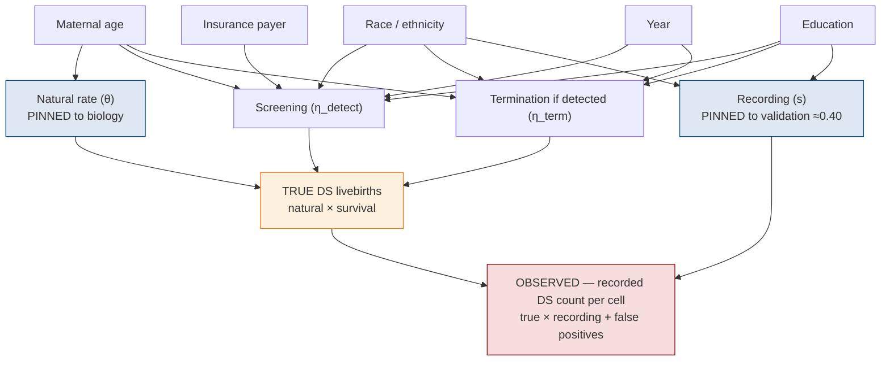
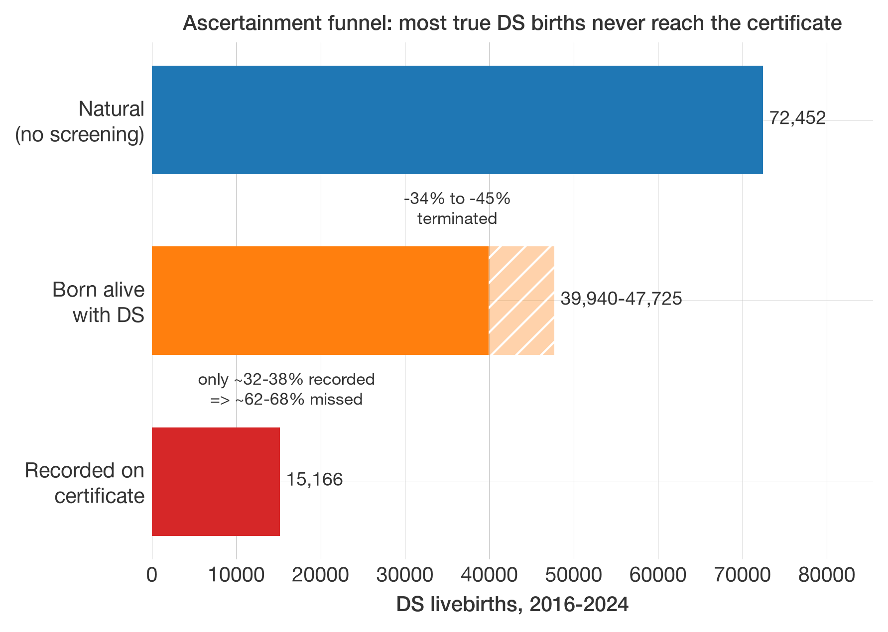
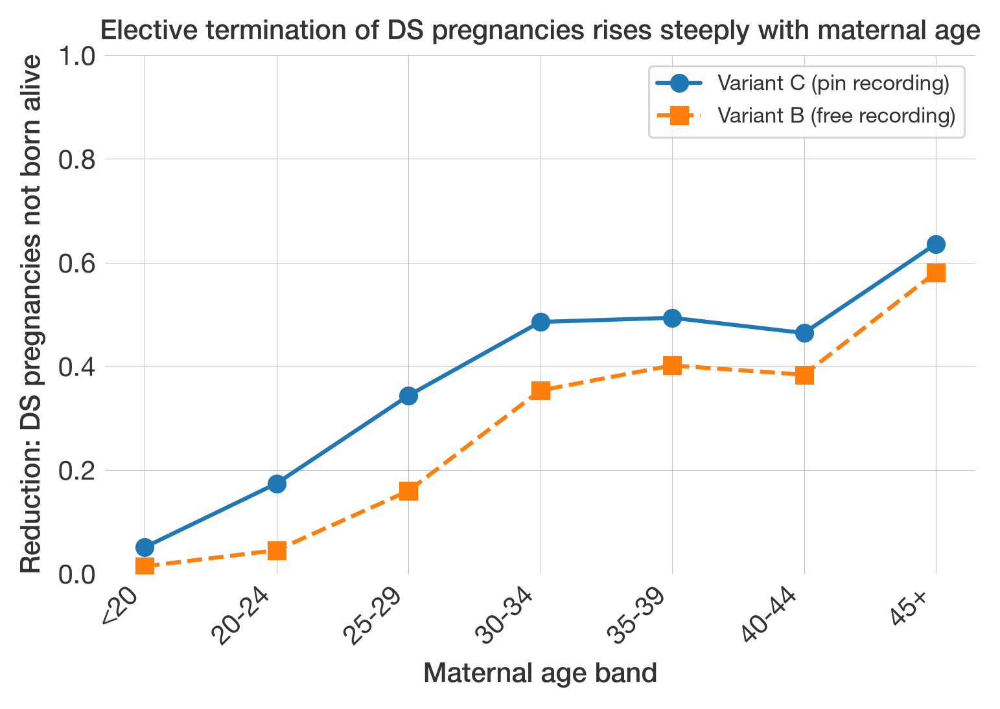
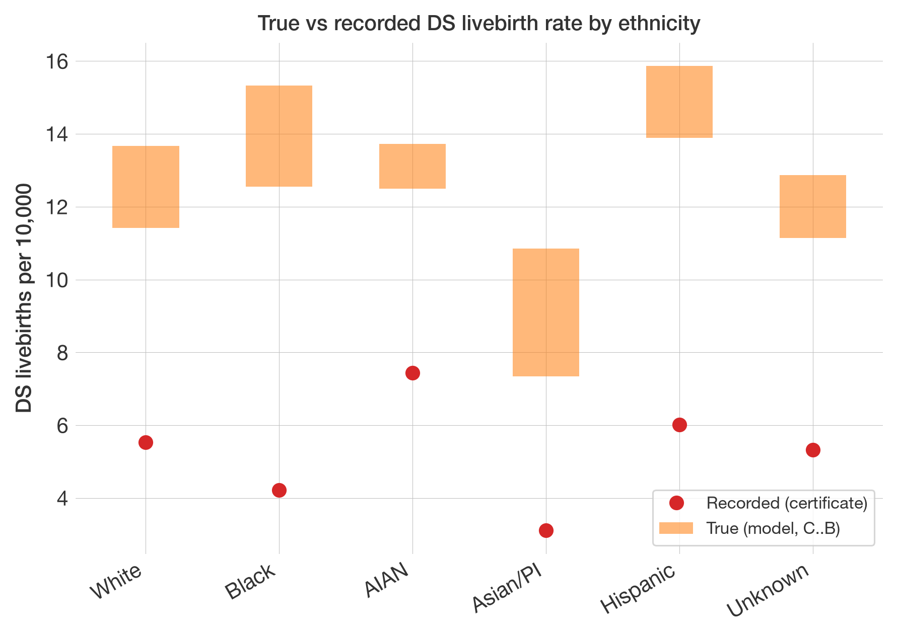
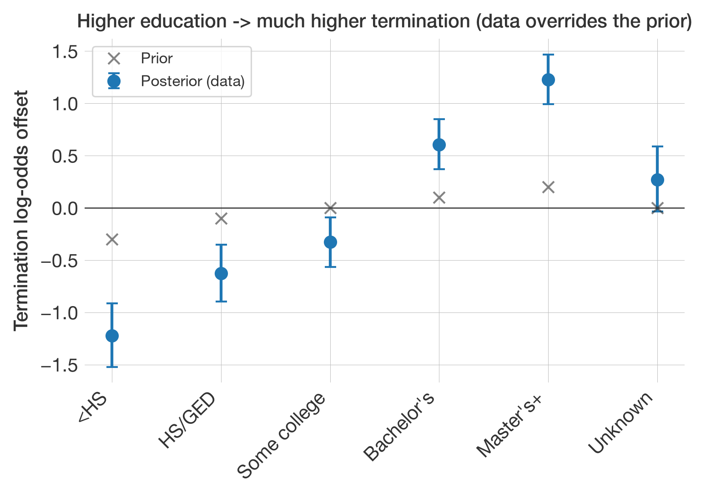
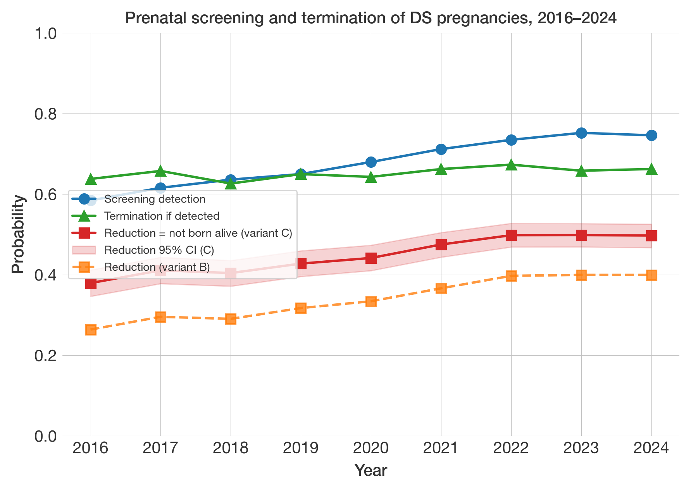
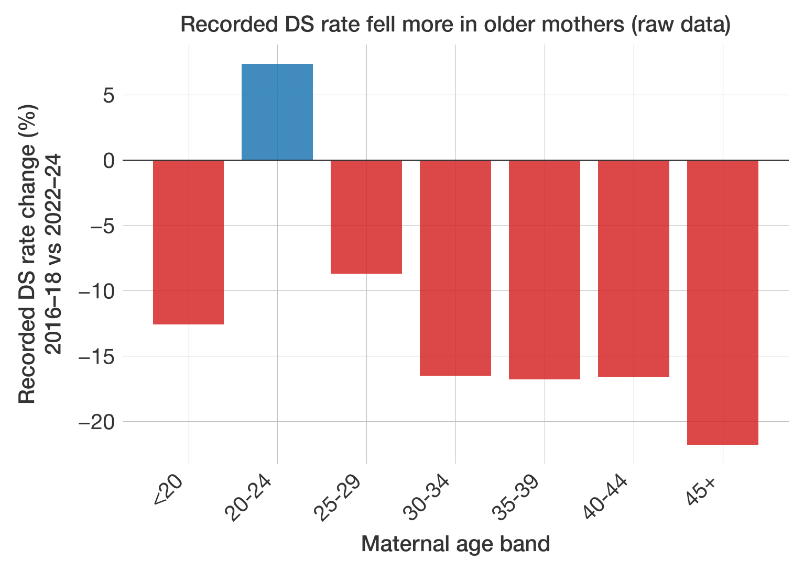

# Estimating Down syndrome births from US birth certificates: a Bayesian selection model and its predictors

**Date:** 2026-06-22
**Status:** preliminary. Numbers are from the publication-quality ("reporting")
fits — 4 chains, 1,500+1,500 draws, all three variants converged. Figures remain
provisional.

---

## 1. Introduction

This study estimates how many babies are truly born with Down syndrome (DS) in the
United States, correcting for the well-documented under-recording of DS on birth
certificates — validation studies that check certificates against medical records
find only roughly 40% of true cases are recorded (Boulet 2011). Naïve counts
therefore understate DS births by around 60%. The project closes that gap two
complementary ways:

- **A machine-learning strand.** Gradient-boosted classifiers (LightGBM) — the "GB
  models", a family of variants (M0–M2) — are trained on the 2016–2024 certificates
  to predict which births were DS, then used to flag *likely-missed* cases and so
  estimate the true total as recorded **plus** predicted. A labelling choice runs
  through that work: **C** (confirmed — births actually recorded as DS) versus
  **C+P** (confirmed *plus* the model's predicted-missing cases). C-only proved the
  cleaner training target, because C+P lets the model lean on a `ca_disor = pending`
  tautology — an unresolved-diagnosis code that mechanically tracks the
  predicted-missing label rather than reflecting genuine DS signal.

- **A structural strand — this document.** Rather than classifying individual
  births, the Bayesian *selection model* estimates the same true total by writing
  down the chain of events that turns a real DS conception into (or fails to turn it
  into) a recorded case, and inverting it. It uses only the recorded counts, and
  serves as a complement and cross-check on the ML estimate.

The rest of this note is about that selection model. We have US birth certificates
for 2016–2024 — about **33.5 million births**, of which **17,776 were recorded** as
having Down syndrome. Because certificates miss many true cases, that recorded count
is an undercount, and we want the **true** number — recorded **plus** missed. You
cannot get it by counting; you have to **model** it.

## 2. The model: a chain from conception to checkbox

The data are simple: we group all 33.5 M births into demographic **cells** — one per
combination of maternal-age band, race/ethnicity, education, insurance payer and
year — and, in each cell, count how many births were *recorded* as DS. That count is
modelled as a **binomial** draw: `N` births in the cell, each with some probability
of showing up as a recorded DS case. We estimate that probability by splitting it
into three stages, each itself a probability:

1. **Natural rate (θ).** Of all births to mothers of a given age, what fraction
   would be DS livebirths *if no-one screened or terminated*? This is biology,
   rising steeply with maternal age (about 1 in 1,500 under age 20, about 1 in 33 at
   age 45+). It is well measured by earlier studies (Morris et al.), so we **pin** it.
2. **Survival (η).** Not every DS pregnancy is born: some are detected by prenatal
   screening and the pregnancy electively terminated. *Survival* is the fraction that
   reach a live birth. It is itself the product of two sub-steps — **screening**
   (does prenatal screening detect the case?) and **termination** (given detection,
   is the pregnancy ended?) — so `survival = 1 − screening × termination`, and the
   complement, `1 − survival`, is the "reduction" (the share not born alive).
3. **Recording (s).** Given a DS baby *is* born, does the certificate record it?
   Validation studies put this around 0.40 — i.e. ~60% are missed — so we **pin** it
   too.

Put together, the chance a given birth shows up as a *recorded* DS case is roughly

```
recorded rate ≈ natural × survival × recording   (θ × η × s; plus a tiny false-positive rate)
```

and the **true** number of DS livebirths is `natural × survival` (θ × η) summed over
all births. Each
stage is allowed to depend on the cell's covariates — age, race, education, payer,
year — which is how we can later read off, say, termination by education. The
generative structure is:



The blue nodes are **pinned** to outside knowledge; the red node is the **only thing
we actually observe** (the recorded count). Everything in between — how many were
really born, how many were terminated, how many were missed — is *inferred*.

## 3. What the Bayesian framing adds

In a frequentist analysis you'd maximise a **likelihood** — the probability of the
data given the parameters — and report point estimates with confidence intervals.
We use the same likelihood (here, a binomial count of recorded DS in each
demographic "cell"), but we also attach a **prior** to each parameter: a
distribution that encodes what earlier studies already tell us (e.g. "s is about
0.40"). Multiplying prior × likelihood and renormalising gives the **posterior** —
the updated distribution of each parameter given both the data *and* the outside
knowledge. A **95% credible interval** is then read directly as "95% probability
the parameter lies here" (conditional on the model and priors).

Why bother? Because — as the next section shows — the data alone *cannot* pin down
all the parameters. The external knowledge in the priors is doing essential work.
That is a strength (it lets us use everything we know) and a liability (the answer
leans on assumptions), and being explicit about it is the whole point.

## 4. The hard part: things that only ever appear multiplied together

Look again at `recorded rate ≈ θ × η × s`. The data only ever see the **product**.
That means the data cannot, by themselves, tell apart:

- *"few DS babies, but well recorded"* (low η, high s), from
- *"many DS babies, but poorly recorded"* (high η, low s).

Both give the same recorded counts. This is called **non-identifiability**. The
closest frequentist analogue is **perfect multicollinearity** in a regression: when
two predictors move together, you can estimate their combined effect but not their
separate coefficients. Here, η and s (and, it turns out, θ) are tangled the same
way. The data fix the product; *something else* has to fix the split.

That "something else" is the priors — i.e. external numbers we pin down. The total
DS estimate therefore depends not just on the data but on **which external numbers
we trust and how hard we pin them**. Keep this in mind; it's the main caveat.

## 5. What went wrong the first time (and what it taught us)

Our first runs produced a nonsense answer: about **226,000** true DS livebirths
over 2016–2024 — roughly **five times** the figure independent surveillance implies
(~45,000). Worse, three model variants that should have disagreed if the answer
were prior-driven all gave the *same* inflated number, which initially looked
reassuring but was actually all three sharing one fault.

The fault: the "natural rate" θ — which we *thought* was nailed down by biology —
quietly drifted to **3–4× its known value**. We had given it a "tight" prior
(a standard deviation of 0.10 on the log-odds scale), but with **33.5 million**
data points the likelihood is so overwhelmingly strong that a 0.10 prior behaves
like a loose suggestion, not a constraint. The data dragged θ 11–15 standard
deviations away from its prior — something that should be astronomically unlikely,
and only happens because the prior was, in effect, far weaker than it looked.

*Why* did θ drift? Because the recorded-DS pattern across maternal age didn't match
what the model could otherwise produce. Older mothers screen and terminate far
more, so their *recorded* DS rate, relative to the natural rate, is much lower than
younger mothers'. The model had no way to express "termination rises steeply with
age" (that age effect was missing from η), so the only knob it could turn to fit
the age pattern was θ itself — and it turned it, breaking the biology.

**Lesson:** at this data scale, "informative prior" is not the same as "fixed
number". Anything you mean to hold fixed has to be pinned *hard*.

## 6. What we changed

Four changes, all aimed at putting each effect where it belongs and pinning the
genuinely-external quantities so the data can't overwrite them:

1. **Pinned θ hard** (standard deviation 0.10 → 0.001). θ is now held at the
   biological values; it can no longer absorb other effects.
2. **Put maternal age where the biology says it acts.** Age now enters three
   places: the natural rate θ (conception — already there), **screening access**
   (older mothers reach screening more), and **termination choice** (it varies with
   age). The steep age pattern now lands in η — the screening/termination stage —
   instead of corrupting θ.
3. **Pinned the recording rate s hard too** (it was escaping the same way θ did),
   at the validation value ~0.40.
4. **Dropped "clinical flags" from the recording stage.** We had let conditions
   like congenital heart defect (CCHD) and NICU admission influence the *recording*
   probability. They misbehaved badly — the model decided NICU babies are recorded
   almost perfectly — because those conditions are actually signs the baby *is* DS
   (CCHD is caused by DS about half the time), not signs of better paperwork. The
   model wasn't allowed to say "more true DS here", so it said "better recording
   here" instead. Removing them stops the distortion. (They're kept for a separate
   analysis of co-occurring conditions, where they belong as *outcomes* of DS.)

We also refreshed the screening numbers for the modern era: prenatal screening
shifted from older blood tests to **cell-free DNA (NIPT)** between roughly 2013 and
2022, which sharply raised detection (and so termination) — a literature review
documents this and feeds the age/year structure of η.

## 7. The result

With those fixes the model converges cleanly (all three variants pass their
convergence checks). The two variants that **pin** the recording rate (A, C) agree
tightly at ~40,000; the variant that instead **frees** recording (B) lands at
~48,000. That spread is now an honest sensitivity range, not a shared fault:

| quantity | estimate (2016–2024) | interpretation |
|---|---|---|
| **True DS livebirths** | **~40,000** (pin recording ≈0.40) **to ~48,000** (let the data set recording ≈0.32) | recorded + missed; the range *is* the recording-assumption bound |
| Recorded (data) | 17,776 (~15,200 after removing estimated false positives) | what the certificates caught |
| **Implied missed** | **~25,000–33,000 (≈62–68%)** | true babies the certificates didn't record |
| Recording rate `s` | 0.38 (pinned) → 0.32 (data-preferred, variant B) | fraction of true DS recorded |
| Termination reduction `1 − η` | ~34–45% overall; age-graded ~5% (under 20) → ~64% (45+) | share of DS pregnancies electively terminated |

Read it as a funnel: absent screening, roughly **72,000** DS babies would have been
born (this baseline is fixed by the pinned biology). Depending on the recording
assumption, **34–45%** of those pregnancies were electively terminated, leaving
**~40,000–48,000** born; of those, only **~32–38%** were recorded, leaving
**~25,000–33,000 missed**. The model also reproduces the recorded counts age-band
by age-band (a "posterior-predictive check") to within about 5%.



## 8. Who the missed cases are — and how the picture is changing

Because every stage can depend on a cell's covariates, the model also says *who* the
true and missed cases are. Three caveats travel with this whole section: the
detection-vs-termination split inside η is prior-driven; recording by subgroup is
**pinned** in the headline variant (so "missed by group" is partly an assumption);
and only the C↔B spread bounds the recording-vs-termination question. With that
flagged:

**Maternal age — the strongest, cleanest gradient.** Elective termination of DS
pregnancies climbs from roughly 5% under age 20 to about 64% at 45+. Both variants
agree on the shape; freeing recording (B) lowers the level but keeps the steep rise.



**Ethnicity — real differences, not an age artefact.** True DS livebirth rates differ
markedly by ethnicity, and the differences **survive age-standardisation**: re-
weighting every group to the national age mix barely moves them, so they are not just
"some groups are older". The striking case — NH Asian/Pacific Islander mothers are
the *oldest* (mean age 32; 31% are 35+) yet have the *lowest* true DS rate, because
their termination is the highest; younger Hispanic mothers have the highest true rate.



The recorded points (red) sit far below the true-rate bands (orange) for every group
— that gap is the under-ascertainment. **NH Black is the one robust *recording*
signal:** its implied recording is the lowest, and when recording is freed (variant
B) the data push it *lower* still, so Black under-recording is data-supported rather
than assumed. For the others, whether the gap is "more termination" or "less
recording" is exactly the non-identified split (e.g. Asian/PI is *either* ~59–72%
terminated *or* recorded at only ~21%).

**Education — the strongest data-identified social gradient, and it lives in
termination.** Education's termination effect was pinned only weakly, and the data
overrode the prior at every level, roughly tripling its spread: termination climbs
monotonically from the least to the most educated (about a 2.4 log-odds gap,
Master's+ versus <HS).



Education's effect on *recording* is, by contrast, weak and vanishes when freed — so
this is genuinely about termination choice, not paperwork. **Insurance** tells a
parallel access story: privately-insured mothers reach screening more than Medicaid
or self-pay patients (the data widened that gap well beyond the prior). But payer
enters the model only through the screening stage, so the gradient is real yet its
*channel* is structural, not independently identified.

In short: the **maternal-age structure** and the **orderings** (who has higher true
rates, who terminates more) are robust and largely data-driven; the
**recording-by-subgroup** numbers are mostly the pinned assumption; and the
**detection-vs-termination split** within any group's gap is bounded by C↔B, not
resolved.

**Over time (2016–2024) — a screening-access story.** The reduction (share of DS
pregnancies not born alive) climbed from **38% [35–41] in 2016 to 50% [47–53] by
2022**, then plateaued. This trend is one of the more robustly *identified* results
in the model: recording carries no year term, so year-to-year movement in the
recorded rate maps directly onto survival — the recording-vs-termination confounding
that clouds the subgroup analysis does not act across years. Splitting the rise (the
split itself is prior-driven): prenatal **screening detection rose from ~58% to ~75%**
as cell-free DNA (NIPT) was adopted, while **termination given detection stayed flat
at ~65%**. So the growing reduction is about more pregnancies being *screened*, not a
change in what families decide once a case is found.



Did screening expand fastest in older mothers, where NIPT was recommended first? The
model cannot answer that on its own: screening is modelled as *additive* in year and
age, with no year-by-age interaction, so it applies one uniform yearly shift to every
age band. The raw data do point that way — between 2016–18 and 2022–24 the recorded
DS rate fell **16–22% in mothers aged 30 and over** but only ~9% at 25–29 (the
youngest bands are small-count noise). Within an age band, recording and the natural
rate are fixed over time, so that decline *is* the rising reduction for that band.
Pinning down the age-by-time interaction properly would need an interaction term and
a re-fit; for now it is a raw-data observation, not a model result.



## 9. Limitations and criticisms

This is where honesty matters most. The model works, but the result should not be
oversold.

- **It is a reconstruction, not a measurement.** Because of the
  non-identifiability (Section 4), the birth-certificate data *cannot* pin the
  total on their own. We resolved the ambiguity by **assumption** — pinning the
  recording rate `s` and the natural rate θ from outside studies. Change the
  assumption and the headline moves: pinning `s ≈ 0.40` gives ~40k; letting the data
  set it (`s ≈ 0.32`) gives ~48k. **The total is roughly inversely proportional to
  the assumed recording rate.** So the honest one-line statement is: *"if
  certificates record ~40% of DS births, then there were ~40,000."* The "if" is
  load-bearing.

- **The external numbers may not fit this population.** The recording-rate
  validation studies are older and from a few states; the screening/termination
  literature is extrapolated to the national 2016–2024 population. If those don't
  generalise, the estimate is biased in ways the credible intervals do **not**
  capture (the intervals reflect sampling noise, not the risk that a pinned
  assumption is simply wrong).

- **"Fits the data" ≠ "correct".** The model reproduces the recorded counts by
  construction — that's what fitting does. We have **no independent gold standard**
  (e.g. a linked birth-defects registry) to check the *missed* cases against,
  because that data isn't accessible. The age-band check is reassuring but weak: it
  only confirms internal consistency, not external truth.

- **We can't separate two of the age effects.** The data identify only the
  *combined* effect of age on η. How much of the age gradient is "older mothers
  access screening more" versus "older mothers choose termination more" is
  **prior-driven** — a modelling choice, not a finding. Treat any such split as
  illustrative.

- **Recording is surely not one flat number.** We pinned `s` at a single level
  (modulated only mildly by race/education). In reality it varies by hospital,
  state, year and case mix. Collapsing that is a simplification that could bias
  subgroup comparisons.

- **The co-occurring-conditions model is unresolved.** The current model treats DS
  as statistically independent of conditions like CCHD, which is biologically
  false. We sidestepped it for the headline total, but it limits the planned
  analysis of conditions that co-occur with DS.

- **The gap to independent estimates is itself informative.** Our pinned-recording
  estimate (~40k at `s ≈ 0.40`) sits below surveillance figures (de Graaf and
  colleagues: ~48k) — but the variant that *frees* recording (B) lands at ~47.7k,
  essentially *on* the surveillance number, by pulling true recording down to
  ~0.32. So the two reconcile **if** certificates record ~32% of DS births rather
  than the ~40% the older validation studies report. The birth-certificate data
  cannot say which is right; the surveillance agreement is mild external evidence
  that true recording may be below the validation value and the total nearer 48k.

- **Provisional.** These are now publication-quality ("reporting") fits and all
  three variants converged, but the project's own plan still flags all data and
  models as preliminary.

## 10. Bottom line

We built a transparent, internally-consistent framework that turns 17,776 recorded
DS births into an estimate of **~40,000–48,000 true DS livebirths** for 2016–2024,
depending on the assumed recording rate — implying that **roughly 62–68% of cases
are missing from birth certificates**, with a clear maternal-age gradient in
elective termination. The upper end of that range coincides with independent
surveillance estimates.

Its real value is not the single number but that **every assumption is explicit and
you can see how the answer depends on it**. The estimate is only as good as the
external screening and recording figures it leans on; it is a literature-anchored
reconstruction, not a direct count, and the honest reading is conditional: *"given
what published studies say about screening and recording, this is the implied
number."* Strengthening it means better external anchors — ideally a linked
registry — not more clever modelling of the same birth-certificate data, which has
already told us everything it structurally can.
