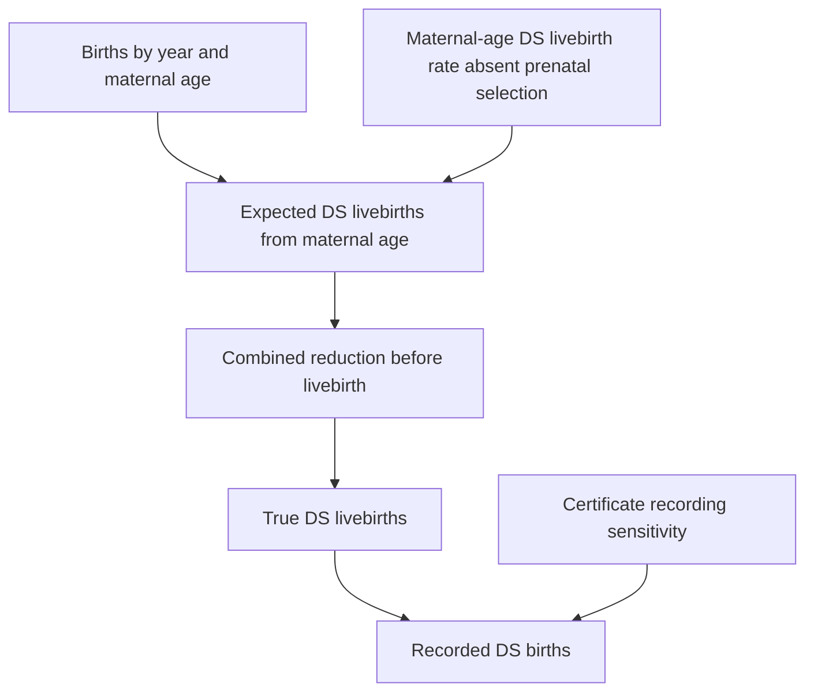

> [!NOTE]
> Drafted by a LLM-based AI tool (Codex/GPT-5).

# Core reduction-recording model

**Date:** 2026-08-02
**Status:** Accepted modelling proposal; implemented as a simpler baseline before
returning to the full detection/termination decomposition.

## Motivation

The current selection model has the right conceptual components, but it tries to
estimate too much at once: maternal-age expected Down syndrome livebirths,
prenatal detection, termination conditional on detection, incomplete
birth-certificate recording, and demographic modifiers on several of those
processes.

That richer structure makes the prior configuration hard to reason about. The
birth-certificate data observe recorded livebirths, not prenatal screens,
diagnoses, terminations, or unrecorded individual DS status. The first model in
the paper should therefore make the central accounting identity clear before
layering on explanatory factors.

## Simpler DAG



The key simplification is to model the combined reduction before livebirth:

```text
rho_year = probability that maternal-age-expected DS livebirths are removed before birth
eta_year = 1 - rho_year
```

Detection and termination can later be decomposed as:

```text
rho = detection * termination_given_detection
```

but that split should not be the first model the reader or sampler has to carry.

## Core model

For year `y` and maternal-age group `a`:

```text
theta_age = external maternal-age DS livebirth probability absent prenatal selection
rho_year  = combined reduction before livebirth
eta_year  = 1 - rho_year
s         = certificate recording sensitivity
f         = small false-positive recording probability

p_ds_lb[y,a]   = theta_age[a] * eta_year[y]
p_recorded[y,a] = p_ds_lb[y,a] * s + (1 - p_ds_lb[y,a]) * f

R[y,a] ~ Binomial(N[y,a], p_recorded[y,a])
```

Start with one overall `s`. Add `s_year`, `s_race_year`, education, payer, and
then detection/termination decomposition only after this core accounting model
fits recorded totals and yields plausible posterior recording rates.

## Reduction prior from surveillance

The tracked reduction series provides a natural prior scale:

```text
rho_year ~ LogitNormal(logit(reduction_csv_year), sigma_year)
```

The important caveat is that surveillance data lag. The repository notes already
flag that 2020-2024 reduction values are linearly extrapolated, so those years
should have wider prior uncertainty than surveillance-grounded years. In the
implemented baseline:

```text
sigma_year = observed_reduction_sigma      for years before the extrapolated tail
sigma_year = extrapolated_reduction_sigma  for the extrapolated tail
```

This treats recent years as nowcasts conditional on the historical surveillance
trend, not as fully observed surveillance estimates.

## Identifiability

The data still mainly see the product:

```text
theta_age * eta_year * s
```

The simpler model does not make that problem disappear. Instead, it makes the
separation explicit:

- `theta_age` is external and fixed to the Morris/de Graaf maternal-age curve.
- `rho_year` is informed by surveillance-derived reduction rates, with wider
  uncertainty where surveillance is extrapolated.
- `s` is estimated from the recorded certificate counts under a weak prior.

This is more defensible than simultaneously asking the birth-certificate data to
separate recording, detection, and termination without first proving the basic
accounting model.

## Layering path

1. Fit the core `rho_year + constant s` model.
2. Allow `s_year` if the posterior predictive check shows clear year drift in
   recording.
3. Add maternal-age modifiers to `rho` only if age-specific recorded rates remain
   systematically misfit.
4. Add race/ethnicity-specific recording sensitivity once the aggregate model is
   stable.
5. Add education and payer effects as secondary national associations, not as
   separable causal mechanisms.
6. Split `rho` into detection and termination only as an assumption-dependent
   extension.

## Publication framing

This baseline supports a clear paper spine:

```text
Recorded DS births
= maternal-age-expected DS births
  x survival after prenatal selection
  x certificate recording sensitivity.
```

Recent-year totals should be reported as nowcasts conditional on reduction-trend
and recording assumptions, not as directly observed surveillance totals.

## Initial fit findings

The first reporting fit of this baseline was run on 2026-08-02 using:

```bash
PYTENSOR_FLAGS=base_compiledir=/private/tmp/pytensor-codex \
MPLCONFIGDIR=/private/tmp/mpl-codex \
conda run -n dspop-us-birth-certificates \
python scripts/fit_core_reduction_model.py \
  --profile reporting \
  --draws 3000 \
  --tune 3000 \
  --chains 4 \
  --target-accept 0.95 \
  --prior-predictive-samples 1000 \
  --nuts-sampler pymc
```

Artefacts were written locally to:

```text
output/selection_core_reduction/20260802-135419
```

A later run with the same reporting sampler settings and the Quarto report
enabled was written locally to:

```text
output/selection_core_reduction/20260802-143559
```

Input scale:

- 63 age-year cells covering 2016-2024.
- 33,527,704 livebirths.
- 17,809 recorded DS births.
- Recorded DS rate: `5.31e-04`.

Sampling diagnostics passed on the saved summary:

- Maximum Rhat: `1.0000`.
- Minimum effective sample size: `1519`.

Headline posterior, conditional on the current Morris/de Graaf age curve, the
surveillance-derived reduction prior, and the weak overall recording prior:

- True DS livebirths, 2016-2024: mean `43,828`, 89% ETI
  `41,444-46,130`.
- Overall certificate recording sensitivity: mean `0.344`, 89% ETI
  `0.326-0.363`.
- Combined reduction before livebirth: about `0.326` in 2016 and `0.452` in
  2024.

The fit supports the usefulness of the simpler accounting model. It reproduces
recorded totals with a plausible overall recording sensitivity and a clear
posterior for true DS livebirth totals. It should not yet be treated as a final
publication model because the main `rho * s` identifiability issue remains. The
model makes that dependence visible rather than resolving it internally.

Immediate next checks:

1. Add posterior predictive plots for recorded counts by year and maternal-age
   band.
2. Compare this baseline against a version with `s_year`.
3. Stress-test reduction-prior width, especially for 2020-2024.
4. Only then add race/ethnicity recording or split `rho` into detection and
   termination.
