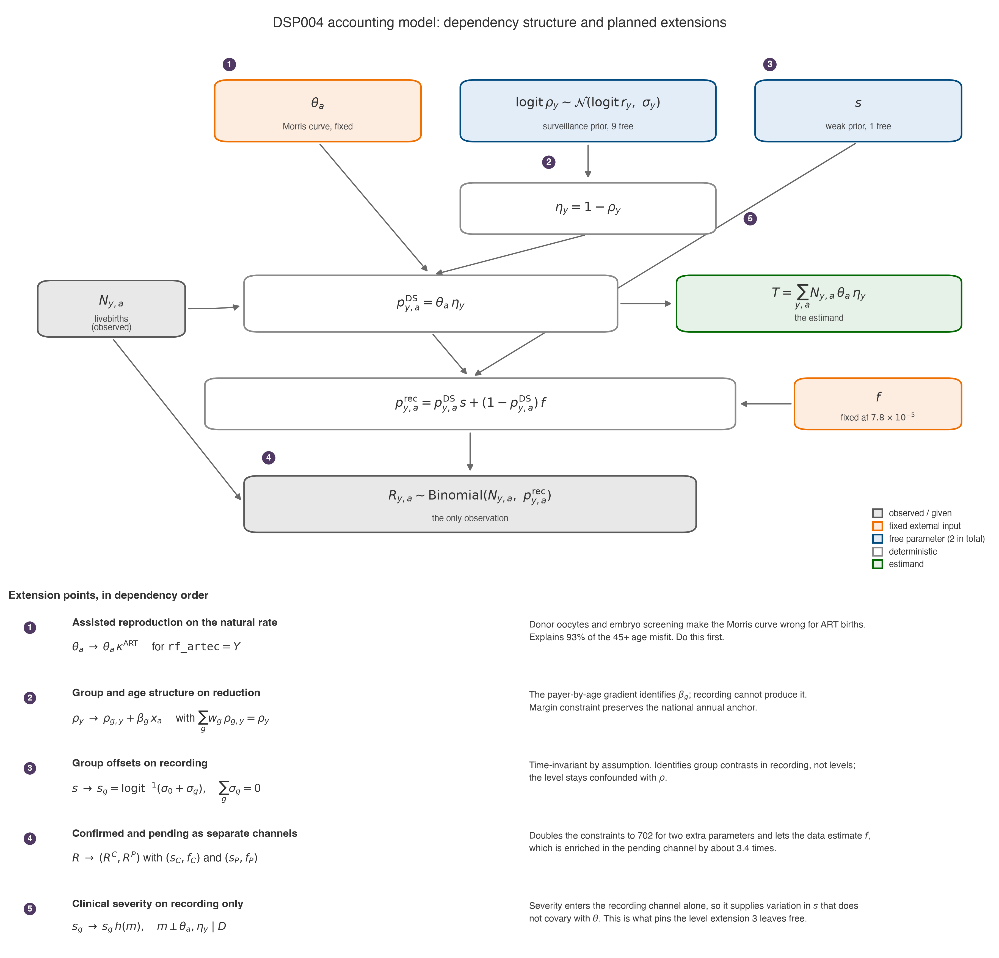

> [!NOTE]
> Drafted by a LLM-based AI tool (Claude Code/Fable 5).

# Review of the DSP001-DSP005 core accounting model family

**Date:** 2026-08-03

**Status:** Independent methodological review. No model was refitted and no
tracked input was changed. Every figure attributed to an existing note is quoted
from that note; every figure marked **[new]** was computed for this review from
`data/us_births.db` and the saved `DSP004` reporting artefacts, and should be
reproduced in a release-conformant environment before it is relied on.

**Amended 2026-08-03**, after reconstructing the reduction series against the
database columns it was built from. The Morris curve largely cancels between
that series' denominator and the model's multiplication, so the original
recommendation to propagate Morris *level* uncertainty into the proposed scale
parameter is **withdrawn**. See "The Morris curve cancels, but only
conditionally" under Finding 2. The withdrawal narrows recommendation 3 and
strengthens recommendation 1; no other finding changes.

**Amended again 2026-08-03**, following a pre-merge verification pass. Three
corrections. The claim that the ART correction lowers the headline total by `3`-`4%`
is **withdrawn**: it holds only if the reduction series is left inconsistent with the
corrected curve, and regenerating the series as recommendation 1 requires leaves the
total unchanged to the birth. Two prior-implied totals under Finding 3 were computed
on the wrong cohort filter and are corrected from `45,698` and `44,432` to `45,607`
and `44,347`, with three coherent-tail values corrected in the fourth decimal.
Recommendation 2 is sharpened: the substantive fix is to extrapolate the prevalence
numerator rather than the ratio.

**Amended a third time 2026-08-03**, after an independent adversarial audit of all
three notes. The audit found further errors, including two introduced by the second
amendment, and they are corrected here. The material ones: the `+452` ablation shift
is evidence *against* cancellation in `DSP001`, not for it; the theta-invariance of
the total holds only if the extrapolated tail is regenerated in prevalence space, and
the grounded years are about a third of the total; the claim that ART correction
raises `s` is incompatible with the total not moving; the `s_year` decline quoted for
`DSP005` was `DSP002`'s; and several code-fact claims under Finding 7 were wrong.
Individual corrections are marked in place. This note no longer claims that every
figure reconciles — only those explicitly stated to have been verified.

## Scope

This reviews the `DSP001`-`DSP005` family as it stands after
[#86](https://github.com/dseinternational/dspopulations-us-birth-certificates/pull/86):
the model code in `src/dspopulations_us_birth_certificates/selection/`
(`core_reduction.py`, `core_models.py`, `core_reporting.py`), the fit and
comparison scripts, the seven design notes from 2026-08-02 and 2026-08-03, the
model inventory in `docs/models/README.md`, and the saved run artefacts under
`output/selection_core_reduction/`.

The frozen reference used throughout is the independent, unshifted reporting fit
at `output/selection_core_reduction/DSP004/20260803-calibration-base-reporting`,
the same artefact the race-surveillance audit froze.

## Verdict

The approach is sound and the documentation is unusually candid about its own
limits. Reducing the five-stage selection model to a two-parameter accounting
identity was the right decision, and the notes correctly and repeatedly state
that the certificate data see only the product
`theta_age * (1 - rho_year) * (s - f)`.

Two things should change before any number is published. First, the headline
89% interval is roughly three times narrower than the family's own evidence
supports, because the reported baseline treats annual surveillance errors as
independent. Second, the one clear model-adequacy failure — the maternal-age fit
— has a specific, testable cause that none of the notes considers, and
correcting it changes the age allocation, the implied reduction rate and the
implied recording sensitivity, though not the total.

A third item is now the largest open risk: the reduction series that determines
the headline total has no derivation recorded anywhere in this repository.

## What the family gets right

These are genuine strengths and should be preserved through any revision.

- The accounting identity is the correct spine, and stating it before layering
  explanatory structure was the right call. The earlier five-stage model asked
  the certificate data to separate detection, termination and recording
  simultaneously; this family does not pretend to.
- The non-identifiability is documented in every note rather than buried, and
  the coherent-calibration note quantifies it directly: the posterior
  correlation between the standardised reduction-trajectory error index and `s`
  is `0.929`-`0.979`.
- The `DSP001` to `DSP004` exact-age ablation is a real improvement with a real
  diagnostic payoff: common-grid mean absolute standardised residual falls from
  `1.690` to `1.019`. The `+452`-birth move in the posterior mean is small in
  absolute terms but, per Finding 2, should not be read as stability — it tracks the
  change in the Morris expectation almost exactly.
- The equicorrelation implementation in `core_reduction.py:174-187` is correct.
  `(1 - lambda) I + lambda J` scaled by the outer product of the sigmas is the
  equicorrelated covariance, and it does preserve every marginal variance as
  claimed.
- Refusing to pool or model-average scenario draws, and stating explicitly that
  the scenario envelope carries no coverage probability, is the right call.
- The race-surveillance audit is exemplary. Recording `calibration_eligible=false`
  on a single incomplete window, rather than calibrating a race layer from it,
  is exactly the discipline this study needs.
- Numerical hygiene is good: `round_to="none"` in `summary_table` so display
  rounding cannot move a value across a convergence threshold; reconstruction
  identities asserted at `1e-15` to `1e-12` in `audit_core_race_surveillance.py`,
  with observed reconstruction discrepancies up to `4.37e-11`; the race audit
  verifying that it performs no DuckDB writes.

## Finding 1 — the total's level is a prior, and its interval is too narrow

The notes say the data see only the product. The stronger statement, which the
notes do not quite make, is that this determines what the posterior for the
total can and cannot be.

Since `T = sum(N * theta * eta)` with `theta` fixed and `N` observed, the total
is a deterministic function of `eta`. The cell likelihood identifies
`eta_year * s` for each of nine years: nine constraints for ten unknowns under
constant `s`. The eight relative year contrasts are therefore data-identified,
and the common level is not. Along that one remaining direction only the prior
speaks, and the total's level is proportional to it.

**[new]** This is arithmetically checkable against the frozen fit. Because
`f` applies to a denominator that is almost the whole cohort,

```text
(17,809 - 33,527,704 * 7.8e-5) / 0.340182 = 44,664
```

against a posterior mean total of `44,255` — agreement to under 1%. This applies `f`
to the whole cohort rather than to non-DS births only, which is why it differs
slightly from the `2,612` false-flag count the model implies. The
recorded counts fix `T * s`; the reduction prior fixes `s`; the total follows.

Two consequences.

**`lambda = 0` is the least defensible point on the correlation axis, and it is
the reported baseline.** The reduction series is one derived series with a
common methodology, a common Morris denominator and a common extrapolation.
Errors in its *level* are close to perfectly correlated across years. Treating
them as independent lets nine annual errors partly cancel when summed, which
manufactures precision in precisely the direction that is otherwise
unidentified. The family's own numbers show the size of the effect from two
directions:

| Evidence | Scale | Width on the total |
| --- | --- | ---: |
| Prior simulation, `lambda=0` | prior | `6,539` |
| Prior simulation, `lambda=0.9` | prior | `17,562` |
| Baseline 89% ETI | posterior | `4,631` |
| Span of primary scenario means (`37,610`-`50,190`) | scenario | `12,580` |
| Span including both joint corners (`34,806`-`50,190`) | scenario | `15,384` |

The three scales are not interchangeable and should not be divided across rows.
Within the prior scale, `lambda=0.9` is `2.7` times as wide as `lambda=0`. Separately,
the scenario-mean span is `2.7` times the baseline posterior interval width and `3.3`
times it with the corners.

**An important counter-observation.** The `lambda=0.9` *posterior* interval is
`4,062`, **narrower** than the baseline's `4,631`, and its mean shifts `-7.62%`. The
coherent-calibration note explains this as conditional model geometry and warns
against reading it as precision. So correlated surveillance error does not widen the
posterior — it relocates it. The case for a wider reported interval rests on the
scenario-mean span and on the `delta` axis, not on the `lambda` posteriors.

**The scenario grid should become a parameter.** A common logit-scale level
error in the surveillance prevalence behind the reduction trajectory, and any
systematic transport error from the surveillance source population to the NCHS
cohort, act on `T` in exactly the same way. They collapse into a single scale
nuisance parameter. Giving that one parameter an explicit prior and integrating
over it would produce an honest interval — plausibly around `±14%` rather than
`±5%` — and would retire the seven-scenario grid, the two corners, the
envelope-is-not-an-interval caveat, and the borderline-MCSE adjudication in one
step.

Morris *level* uncertainty should **not** be added to that prior, because it
largely cancels; see Finding 2. What Morris does still control is the *age
allocation* of the total, which is where Finding 4 bites, and the small
non-cancelling residual from the difference between the source's age grouping
and the model's exact-age grid. No standard errors or covariance for the Morris
double-logistic parameters `(7.33, 4.211, 0.2815, 37.23)` are recorded anywhere
in the repository, but for the total that matters less than it appears.

## Finding 2 — the reduction series has no recorded provenance

`data/us-births-reduction-rates-1989-2024.csv` supplies the prior mean for
`rho_year` and therefore determines the headline total. No script, notebook or
documented calculation in this repository produces it. `git log --follow` gives
three commits, all import or move operations; the file arrived already-final in
the port from `previous/`, and the originating workbook was not ported.

The repository already records the gap.
`notes/20260627-data-prep-adjustments-validation.md` says "Math correct;
**provenance missing**", and `docs/data-preparation.md` says the in-repo
provenance of these series "is currently thin and should be recorded (source,
vintage, method)".

**[new]** Reconstructed numerically, the series is
`1 - surveillance_prevalence / Morris_expected_prevalence`, where the Morris
expectation is births-weighted. It is *not* derived from
`data/us-births-degraaf-prevalence-recording-2000-2024.csv` and not from
`scripts/derive_recording_rates.py`. That is a genuinely separate path, and the
`DSP00x` models never consume any `recording_anchor` value — `priors.py:34` does
import from it, but no anchor quantity reaches the core models — so the circularity
that
`notes/20260707-s-anchor-and-identifiability-diagnostic.md` documents for the
older model does not apply here.

**[new]** The construction is confirmed directly against the database columns it
was built from. `1 - AVG(p_ds_lb_wt) / AVG(p_ds_lb_nt)` reproduces the CSV to
`9.1e-04`, `6.1e-04` and `4.6e-04` relative for 2016, 2017 and 2018. At 2019 it
diverges by `3.1e-02`, giving `0.383930` against the CSV's `0.372370` — an
independent confirmation, from a different route to the one in Finding 3, that
2019 was filled from the trend line rather than computed.

### The Morris curve cancels, but only conditionally

Because the reduction series was built by *dividing* by a births-weighted Morris
expectation, and the model then *multiplies* by the same curve, the curve
cancels out of the total:

```text
1 - rho = S / M   =>   T = N * M * (1 - rho) = N * S
```

So the prior-implied total is the de Graaf surveillance prevalence times NCHS
births, with Morris dropping out. This explains why refining the age resolution
from seven bands to single years moved the total by only `+452` births despite
changing every `theta`, and it is why Morris *level* uncertainty does not belong
in the scale parameter proposed under Finding 1.

The cancellation is exact algebraically but **conditional in practice, and
nothing in the code enforces it.** It holds only because the frozen CSV happens
to have been built from this repository's own `p_ds_lb_nt` Morris column.
Changing `MORRIS_PARAMS` in `chance.py` without recomputing the CSV would break
it silently, and `T` would then scale directly with the curve. The provenance gap
above is therefore more consequential than it first appears: it is what turns an
exact cancellation into an unverifiable assumption. Any revision to
`MORRIS_PARAMS` must regenerate the reduction series, and that coupling should be
stated in `docs/data-preparation.md` and ideally asserted in a test.

What does not cancel — and what the coherent-calibration `delta` axis actually
measures — is the level uncertainty in the surveillance prevalence itself.

The question that matters cannot be answered from the repository at all:
**whether the surveillance numerator is raw surveillance-programme prevalence or
an ascertainment-adjusted modelled estimate.** If it is the adjusted estimate,
the anchor already contains a recording-rate correction and the independence the
family relies on is weaker than assumed. There is no citation, no vintage and no
method note. A precision discontinuity at 2014/2015 — four significant figures
through 2014 (`0.001302`), seven from 2015 (`0.001265051`), with 2017 at five — is consistent with two spliced source vintages, and
`docs/data-preparation.md` already flags it.

Everything downstream is conditional on this file, including the whole
coherent-calibration analysis. It should be the first thing resolved.

Relatedly, the `0.20` and `0.45` logit standard deviations have no documented
derivation either. They are asserted in the `from_reduction_csv` signature and
restated in the notes as fixed inputs. Since the headline interval is
essentially a deterministic image of those two numbers, they need a stated
basis wherever the total is published.

## Finding 3 — the extrapolated tail is not internally coherent

Reduction is a ratio whose denominator is the births-weighted Morris
expectation, and that denominator is not static: maternal ageing raised it
substantially over the period. The tail was built by extrapolating the *ratio*
linearly, which implicitly holds the denominator near its 2018 level.

**[new]** The 2020-2024 values are exactly an ordinary-least-squares line fitted
through 2008-2019, slope `+0.005964956` per year. Recomputing the ratio against
each year's actual Morris expectation, holding the surveillance numerator at its
last grounded value, gives a materially different trajectory:

| Year | CSV prior | Coherent recomputation | `DSP004` posterior mean |
| ---: | ---: | ---: | ---: |
| 2019 | `0.3724` | `0.3837` | `0.3702` |
| 2020 | `0.3783` | `0.3936` | `0.3839` |
| 2021 | `0.3843` | `0.4058` | `0.4213` |
| 2022 | `0.3903` | `0.4220` | `0.4537` |
| 2023 | `0.3962` | `0.4307` | `0.4532` |
| 2024 | `0.4022` | `0.4392` | `0.4556` |

The Morris expectation per birth rose from `2.110542e-03` in 2018 to
`2.362013e-03` in 2024, `+11.9%`. The prior-implied 2016-2024 total falls from
`45,607` under the CSV series to `44,347` under the coherent recomputation, a
change of `-2.8%`, landing almost exactly on the published posterior mean of
`44,255`.

This changes the interpretation of the tail. **[new]** Roughly `60%` of the
prior-data conflict in 2021-2024 — `58%`, `50%`, `61%` and `69%` year by year — — which a constant-`s` reading would attribute to
recording holding steady while reduction rose — is instead the extrapolation
failing to track a denominator that is known and moving. Any statement that
combined reduction rose sharply after 2020 is currently confounded with the
extrapolation method.

**2019 is extrapolated but receives the tight observed prior.** **[new]** The
Morris denominator implied by the 2019 entry is `2.110442e-03`, which equals the
*2018* expectation of `2.110542e-03` to five parts in a hundred million, not the
actual 2019 value of `2.149455e-03`. The 2019 value also lies on the
extrapolation line to within `3e-10`. So 2019 was filled from the line and the
last surveillance-grounded year is 2018. But
`DEFAULT_EXTRAPOLATED_REDUCTION_START = 2020` (`core_reduction.py:51`) gives
2019 the observed sigma of `0.20` rather than the extrapolated `0.45`. Six
extrapolated years are treated as five, with the mislabelled year given less
than half its intended prior width. The database recomputation in Finding 2
confirms this independently: it agrees with the CSV to under `1e-03` relative for
2016-2018 and then diverges by `3.1e-02` at 2019.

Separately, the extrapolation carries a pre-2019 behavioural trend straight
through the COVID-19 disruption to prenatal care and the June 2022 *Dobbs*
decision, with no structural break, in exactly the years of greatest policy
interest. Because termination decisions precede birth by several months, a
mid-2022 break maps mostly onto 2023 births.

## Finding 4 — assisted reproductive technology appears to explain the age misfit

The broad-age posterior-predictive coverage of `1/7` is treated across three
notes as an unresolved allocation between age-varying reduction and age-varying
recording, with the mirrored age-on-recording diagnostic named as the next gate.
A third explanation is available, it is testable in data already extracted, and
it appears to account for most of the failure. The evidence below is a
posterior-mean residual decomposition, not a fitted result.

`rf_artec` (assisted reproductive technology) is already in the pipeline via
`data_utils.py`. **[new]** Comparing observed recorded counts against the
`DSP004` posterior-mean prediction, by ART status:

| Maternal age | ART births | ART observed/predicted | Non-ART observed/predicted |
| --- | ---: | ---: | ---: |
| under 35 | `194,597` | `0.97` | `1.05` |
| 35-39 | `176,425` | `0.43` | `0.98` |
| 40-44 | `82,329` | `0.25` | `1.09` |
| 45+ | `25,643` | `0.06` | `0.97` |

The coding is unambiguous. At 45 and over, `rf_artec='X'` with `rf_inftr='N'`
covers `59,545` births with `391` recorded cases (`6.57` per 1,000), while
`rf_artec='Y'` with `rf_inftr='Y'` covers `25,643` births with `11` recorded
cases (`0.43` per 1,000) — a fifteen-fold difference.

**[new]** At 45 and over, ART is `28.9%` of births but `2.7%` of recorded cases,
and accounts for `162` of the band's `+175` over-prediction, or `93%`. Once ART
births are set aside the band fits almost exactly, `0.968` against `0.697` with
them included. At ages 48-50, where roughly half of all births are ART, there
were **zero** recorded Down syndrome cases among `9,779` ART births.

Three mechanisms push the same way and two of them are `theta` effects rather
than reduction effects: donor oocytes carry the donor's age-related risk rather
than the recipient's; preimplantation genetic testing for aneuploidy removes
trisomy-21 embryos before transfer; and ART pregnancies are screened far more
intensively. Applying the Morris curve at face value to ART births therefore
overstates the natural expectation where `theta` is largest.

**[new]** ART births are `1.4%` of the cohort but contribute `3,403` of the
`73,397` Morris-expected cases, `4.6%`.

**What the correction does and does not change.** It does *not* change the
headline total, once the Morris cancellation of Finding 2 is respected. Scaling
`theta` for ART births by the multipliers their observed-to-predicted ratios imply
(`0.974` under 35, `0.432` at 35-39, `0.245` at 40-44, `0.064` at 45+) lowers the
Morris expectation from `73,397` to `71,051`, `-3.2%`. If the reduction series is
left as it is, the prior-implied total falls to `44,156`, also `-3.2%` in aggregate
though not year by year, since ART's share of the Morris expectation rises from
`3.40%` to `5.91%` across the window.

The invariance is conditional in a way the second amendment did not state. `T = N * S`
requires `(1 - rho) = S / M` in every year, which Finding 3 establishes holds only for
2016-2018 — about a third of the total. So regenerating the series restores exact
invariance **only if the extrapolated tail is regenerated in prevalence space**, which
is what sharpened recommendation 2 asks for; on that convention the total returns to
`45,607` to the birth. If instead the tail keeps its extrapolated ratio and only the
grounded years are recomputed, the total falls by roughly two thirds of `3.2%`.

These multipliers are also an upper bound on the `theta` effect. Of the three
mechanisms above, donor oocytes and embryo screening act on `theta`, but intensive
screening of ART pregnancies acts on `eta`. Attributing the whole observed deficit to
`theta`, as the multipliers do, therefore overstates the curve correction.

An earlier draft of this note claimed the correction would lower the total by
`3`-`4%`. That figure is an artefact of leaving the series inconsistent with the
curve, which is the very inconsistency recommendation 1 exists to remove, and it
is withdrawn. What the correction does change is real and substantial: the age
allocation and hence the broad-age posterior-predictive failure, the implied
reduction rate, the roughly `12%` of the apparent time trend that is ART composition
rather than behaviour, and the contamination of every group comparison. Note that `s`
does **not** materially change either: Finding 1's identity `s ~ (R - fN) / T` fixes
it once `T` is fixed.

This also explains a puzzle in the `DSP003` note, which records that ages 48, 49
and 50+ are over-predicted at `sigma=0.10`, that the sparse tail is influential,
and that the total swings `40,845`-`44,511` across smoothing choices at fixed `f` —
the wider `39,601`-`44,511` range in that note crosses the `f` axis as well. Those
are
the ART-dominated ages. `DSP003`'s smooth age effect is being asked to absorb an
ART composition artefact at the top of the range and a genuine screening-uptake
gradient at the bottom, which is why it is so sensitive to `sigma`.

**The residual is real and points one way.** **[new]** After excluding ART, a
monotone gradient survives at younger ages: observed/predicted of `1.332` at
under-20, `1.194` at 20-24, `1.098` at 25-29, against `0.955` at 30-34. That is
consistent with age-varying reduction. Here the notes are over-cautious in
treating the two allocations as symmetric: `priors.py` already encodes a steep
externally-anchored age gradient on detection (`ETA_DETECT_AGE`, `-1.5` to
`+1.9` on the logit, described as well anchored to advanced-maternal-age
uptake), while there is no external evidence for a steep opposite-signed age
gradient in certificate recording. If anything, prenatally diagnosed cases —
concentrated among older mothers — should be better documented, which would make
the misfit worse rather than better. Treating the two as equally plausible
discards evidence the project has already assembled.

## Finding 5 — the time-trend allocation is set by a prior-width ratio

**[new]** The clearest empirical signal in the data is that the quantity the
likelihood actually identifies, `(R/N - f) / (sum(N * theta) / N)`, falls
monotonically:

| Year | Identified `eta * s` | Standard error |
| ---: | ---: | ---: |
| 2016 | `0.2336` | `0.0058` |
| 2018 | `0.2262` | `0.0057` |
| 2020 | `0.2118` | `0.0056` |
| 2022 | `0.1873` | `0.0051` |
| 2024 | `0.1870` | `0.0051` |

That is a `-19.9%` decline over nine years. No single year-to-year step exceeds
`1.8` standard errors in the full nine-year series, of which the table above shows
alternate years only, but the cumulative trend is unambiguous. Every
substantive conclusion about change over time is a choice about how to divide
that decline between rising reduction and falling recording, and the certificate
data cannot make the division.

`DSP004` assigns all of it to reduction. The project's own de Graaf-derived
recording anchor assigns much of it to recording:
`notes/figures/recording_rates_anchor.csv` shows `s` for NH White falling from
`0.4615` in 2016 to `0.3831` in 2024, `-17%`. These two artefacts in the same
repository resolve the same discrepancy in opposite directions, and the `DSP00x`
notes never mention the second. The anchor is used here only to *bracket* the range
of allocations the same evidence admits, not as independent evidence — the companion
group note is right that it cannot arbitrate, being built from the same recorded
counts and the same Morris curve. The two rest on different tail assumptions — the
anchor holds the survival ratio flat from 2018, the reduction CSV extrapolates
it — but between them they bracket the answer, and only one bracket is currently
reported.

`DSP005` does not settle it. Its split between `rho_year` and `s_year` is
determined by the ratio of prior widths — `0.20`/`0.45` on reduction against
`0.35` on the centred recording offsets — and that ratio has no evidential
basis. `DSP005` reads as a test of year-varying recording but functions as an
arbitrary apportionment. `DSP005`'s posterior `s_year` declines `0.3603` to `0.3248`,
`-9.9%`, roughly half the anchor's `-17.0%`, and should not be read as evidence about
the true split. (An earlier draft quoted `0.363` to `0.331`, which is `DSP002`'s
band-resolution series, not `DSP005`'s.)

**[new]** Rising ART use also contributes a pure composition artefact that the
model currently books as rising termination. ART's share of Morris-expected
cases grows from `3.40%` in 2016 to `5.91%` in 2024, and the identified
`eta * s` declines `-17.5%` among non-ART births against `-19.9%` overall — so
about `12%` of the observed trend is composition, not behaviour.

## Finding 6 — two assumptions carrying more weight than their evidence

**The false-positive rate has a documented units error.** `f = 7.8e-5` implies
that `14.7%` of all recorded flags are false. The `DSP003` note records the
derivation: a `7.8%` false-coded *share* from Johnson et al. (1985) multiplied
by an *assumed* recorded rate of `1e-3`. `audit_core_reduction_assumptions.py`
carries a warning function stating the same and that the audit "does not treat
that conversion as transportable". A share among recorded flags, times an
assumed rate per all births, is being applied as a probability per non-DS birth.
The project knows this and the value still ships as the reference default. To
the notes' credit `T` is nearly invariant to `f`; `s` is not, moving `0.401` to
`0.313` across the grid.

**The numerator definition interacts with the only external check on `s`.** Of
the `17,809` flags, `9,825` are pending and `7,984` confirmed — `55%` pending.
Confirmed-only gives `s = 0.186`, though that is a `DSP003` run and the `DSP003` note
states it must not be compared directly with confirmed-or-pending sensitivities; the
`DSP004` confirmed-or-pending fit at `f=0` gives `0.401`.
Boulet's record-linkage sensitivity is genuinely
independent evidence about `s`, and it is the only external check available on
the one non-identified direction. It is not currently reported as such. Whether
Boulet's denominator corresponds to confirmed-or-pending or to confirmed alone
determines which of the model's own `s` estimates it should be set against. The
model's own confirmed-only fit gives a total of `42,971`, `3%` *below* the
confirmed-or-pending reference rather than above it. An earlier draft asserted the
mismatch implied a total roughly `80%` higher; that figure paired a
confirmed-or-pending numerator with a confirmed-only sensitivity and is withdrawn.
The definitional question remains worth resolving, but it is not the largest item on
the roadmap.

> **Correction and resolution (2026-08-04).** This finding originally cited
> Boulet's sensitivity as "approximately `40%`". **That figure appears nowhere in
> the paper** and is withdrawn: Boulet reports `18.1%` for Down syndrome
> specifically (113/625) and `23%` across six defects. Both questions the finding
> raises are now answered in
> [the study-area transport note](20260804-salemi-boulet-study-area-transport.md).
> Boulet's denominator is the **confirmed-or-pending** analogue, because the
> 1989-revision certificate carried a flat list of anomaly checkboxes with no
> karyotype sub-field; the confirmed-only comparator is Salemi's `7.0%`. Both
> studies were run in low-recording areas — Florida is the third-lowest-recording
> state in the country — and transported to national recording level they give
> `0.374` and `0.319`, which bracket the posterior `s = 0.344`. **The external
> check corroborates the family rather than challenging it.** The `~40%` the
> project had been using was approximately right for the wrong reason.

## Finding 7 — verification gaps

The infrastructure is well built, but the checks that would catch this family's
specific failure modes are the ones missing.

1. **No parameter recovery or simulation-based calibration for any core model.**
   `tests/test_selection_parameter_recovery.py` exercises `selection/model.py`;
   its recovered parameters do not exist in the core models. Nothing probes the
   `rho`/`s` ridge that every note names as the central weakness. Every test in
   `tests/test_core_reduction_model.py` uses prior-predictive draws or graph
   inspection; none calls `pm.sample`. There is no core-cell simulator.
2. **The fit script never fails.** `scripts/fit_core_reduction_model.py:374-384`
   prints a warning, and the function returns `0` regardless at line 399;
   divergences are not read at fit time at all. `output/selection_core_reduction/DSP001/20260802-152232`
   records max Rhat `1.1400` and minimum ESS `12` and carries a complete set of
   tables, plots and `year_summary.csv`, indistinguishable from a healthy run.
3. **The convergence gate misses free random variables.** `summary_vars` omits
   `rho_age_step`, which is `DSP003`'s 38 actual free parameters; only the cumulated,
   centred transform `rho_age_offset` is checked, and that is not a per-coordinate
   monotone map. `rho_logit_year` is also omitted but has no practical consequence:
   the monitored `rho_year` is its per-year monotone image, and ArviZ's
   rank-normalised `r_hat` and ESS are invariant under monotone transformation.
4. **Coverage is reported without a reference level.** The `DSP004` `f=0` run
   shows `55.3%` cell coverage against a nominal `89%` and no code path flags
   it. The only coverage-versus-threshold comparison in the repository is in the
   old model's recovery test.
5. **`rho_year_margin_error` is computed, saved to the NetCDF, and read by
   nothing** — no tolerance in any test, the fit script or the report template.
   It converges to machine epsilon on the current grid, but a wider
   `reduction_age_step_sigma`, a large calibration shift or an extended age
   range could break the fixed 12-iteration solve silently.
6. **No MCSE *gate*, and no energy/BFMI or tree-depth diagnostics at all.**
   `mcse_mean` and `mcse_sd` are present in every core `summary.csv` because
   `az.summary` emits them, and the coherent-calibration note uses them by hand; what
   is missing is any automated check against them. Energy/BFMI and tree-depth
   saturation are genuinely absent.
7. **Prior-predictive draws are sampled and saved but never consumed.** There is
   no prior-predictive check on `R_obs` for any core model. What the report
   calls prior-versus-posterior is an analytic logit-normal quantile
   calculation.
8. **No manifest for core fits.** `manifest.py` records the git SHA and package
   versions but is written only by `scripts/fit_model.py` and read by
   `scripts/compare_variants.py`. Core-model artefacts
   carry no provenance and no recorded health status.
9. **The rejection branches of `_exact_grid_for_comparison` are untested** — its
   seven `raise` sites in `compare_core_reduction_models.py` cover mismatched
   recorded definition, year range, false-positive rate, cell grid, cohort totals
   and missing columns. Only the happy path is exercised, by
   `tests/test_compare_core_reduction_models.py:382`. These are the checks that stop a scientifically invalid
   comparison.
10. **Artefact-contract drift.** All nine `DSP003` runs predate
    `core_ppc_by_age_band.csv`, which `compare_core_reduction_sensitivities.py`
    lists in `REQUIRED_TABLES`, so the `DSP003` sensitivity grid cannot be run
    through the sensitivity comparison without refitting.

Model comparison is deliberately descriptive — no LOO or WAIC, self-documented
and test-pinned. That is defensible across differing cell aggregations, but it
means `DSP003`'s better in-sample fit carries no penalty for its 38 extra
parameters, and there is no held-out or temporal cross-validation anywhere.

## Finding 8 — documentation and internal consistency

- **Two `DSP004` baselines are in circulation.** `44,280` with an interval of
  `41,934`-`46,562` in the ablation and false-positive notes, and `44,255` with
  `41,934`-`46,565` in the coherent-calibration note, which anchors all of its
  materiality percentages and which the race audit then freezes. The runs differ
  in sampler (pymc against nutpie) and in retained draws (1,500 against 3,000).
- **The "matched settings" claim does not hold.** The ablation note presents
  `DSP004`/`DSP005` as changing only the age resolution relative to
  `DSP001`/`DSP002`, but the false-positive note records 1,500 retained draws
  against 3,000. The headline `+452` and `+524` shifts compare runs at different
  simulation precision, as does the `DSP004`-versus-`DSP003` gap of `2,447`.
- **The most consequential result is missing from the spine note.**
  `notes/20260802-core-reduction-recording-model.md` was revised at
  [#86](https://github.com/dseinternational/dspopulations-us-birth-certificates/pull/86),
  after the coherent-calibration work landed at
  [#82](https://github.com/dseinternational/dspopulations-us-birth-certificates/pull/82),
  yet it links every other note except that one and still reports only the
  approximately `3%` effect of widening independent priors. A reader of the
  primary note comes away believing headline uncertainty is around `±5%` when
  scenario-mean shifts of `±13`-`15%`. That is a sensitivity envelope rather than an
  interval — the distinction this note praises the corpus for making elsewhere — but
  it is the right order of magnitude for what a reader should take away, and the
  spine note's own "roughly doubles the 89% interval width" is closer to it than to
  `±5%`. The spine note also omits the `DSP002` note, so two of the six other design
  notes are unlinked, not one.
- **The `DSP002` note is stale.** It still names `DSP001` as the primary simple
  model and carries no supersession marker, unlike the `DSP003` note.
- **A retracted claim was never revised.** The false-positive note's
  "effectively indistinguishable" conclusion rests on an MCSE argument that the
  coherent-calibration note explicitly disowns because seed 47 was reused. The
  claim is repeated in the spine note's follow-up.
- **A label disagrees across documents.** `docs/models/README.md` calls
  `DSP002` a band-resolution sensitivity; the notes treat it as the
  year-varying-recording reference.
- **A test cites a non-existent section.** `tests/test_selection_priors.py:82`
  cites "plan §10 #3"; `plans/readme.md` has no numbered sections.
- **Rounding cluster.** Several headline deltas cannot be re-derived from the
  published tables because they were taken on unrounded posteriors without
  saying so. Individually trivial, collectively it means no table in the corpus
  is self-checking.

## Follow-up analyses

Two companion notes take Findings 4 and 6 further with new diagnostics, and both
change the recommended sequencing below.

- [Estimating the false-positive rate from the age gradient and the
  confirmed/pending split](20260803-false-positive-channel-identification.md)
  shows that `f` is estimable rather than merely importable: the `58`-fold `theta`
  range identifies it as a regression intercept, the combined-channel estimates come
  out above the `7.8e-5` default, and the pending channel carries about `3.4` times
  the confirmed channel's rate. Those estimates are upper bounds, so they do not by
  themselves establish that the true `f` is higher. It also shows `f` distorts group comparisons far more
  than it does the national total.
- [Identifying group effects on reduction separately from
  recording](20260803-group-reduction-recording-identification.md) establishes that
  stratification alone can never separate the two, records the fully identified
  group-level ratio, and proposes a payer-by-age sign restriction. The
  Medicaid-to-private ratio is indistinguishable from `1` below age 30 and reaches
  `1.63`-`1.89` above 35, invariant to the Morris curve. Recording mechanisms could
  in principle produce such an interaction, but their sign is adverse, so the
  observed pattern bounds the reduction contrast from below at `1.91`-fold. A
  maternal-education test fixes that sign empirically: the ratio *falls* with
  education at ages 40 and over, from `0.305` to `0.123`, which is the opposite of
  what a recording explanation predicts.

Both reinforce recommendation 4: the ART correction should come before any
race or socioeconomic layer.

`DSP004`'s dependency structure, with the extension points these two notes propose
numbered on the nodes they attach to, is drawn in
`notes/figures/dsp004_dag_extensions.png` (SVG alongside it), regenerated by
`python scripts/model_dag_figure.py`.



## Recommended next steps

Ordered by the ratio of consequence to effort. Items 1-4 should be settled
before any figure leaves the repository.

### 1. Record the provenance of the reduction series

Establish and document, in `docs/data-preparation.md`, the source, vintage and
method behind `data/us-births-reduction-rates-1989-2024.csv`. The specific
question to answer is whether the surveillance numerator is raw
surveillance-programme prevalence or an ascertainment-adjusted modelled
estimate; the independence of the whole family turns on it. Resolve the
2014/2015 vintage splice at the same time. If the numerator cannot be
established, that limitation belongs in the abstract, not in a note.

Record at the same time that the series' denominator must stay consistent with
`MORRIS_PARAMS`, since the Morris cancellation described under Finding 2 depends
on it and nothing currently enforces it. A test asserting that the tracked CSV
still reproduces `1 - p_ds_lb_wt / p_ds_lb_nt` for the surveillance-grounded
years would make the coupling visible and would have caught the 2019 fill.

### 2. Rebuild the extrapolated tail coherently and relabel 2019

Extrapolate the **prevalence numerator** and derive the ratio from it, rather than
extrapolating the ratio and letting the implied prevalence trajectory fall out
unnoticed. That is the substantive content of this recommendation: recomputing
against actual Morris expectations is not sufficient on its own, because a
prevalence trajectory still has to be chosen.

**[new]** The clearest statement of the current problem, and the form in which it
should be put to the surveillance source: given each year's actual births-weighted
Morris expectation, the tracked reduction values for 2019-2024 imply that Down
syndrome livebirth prevalence **rose `6.6%`** between 2018 and 2024, from `1.3245`
to `1.4119` per 1,000. Holding prevalence flat at its 2018 value instead gives the
coherent reduction trajectory tabulated under Finding 3. So the question is not
whether the arithmetic is right but which prevalence trajectory was intended; the
extrapolated ratio silently encodes a rising one.

Set `DEFAULT_EXTRAPOLATED_REDUCTION_START = 2019` in `core_reduction.py:51` so the
first extrapolated year receives the extrapolated prior width. Under the
flat-prevalence reading, expect the prior-implied total to fall by roughly `2.8%`
and the tail prior-data conflict to fall by roughly `60%`. Record whether a *Dobbs*
structural break is being assumed absent, and say so where the 2022-2024 nowcasts
are reported.

### 3. Replace the scenario grid with one estimated scale parameter

Add a single common logit-scale level parameter on the reduction trajectory with
an explicit prior combining surveillance-prevalence level uncertainty and
transport error, and integrate over it. Report that interval as the headline. Do
**not** include Morris level uncertainty in that prior — it cancels, per
Finding 2. This retires `--reduction-calibration-shift-logit`, the seven
scenarios, the two corners, the envelope caveat and the MCSE adjudication, and
it is the only way the published interval can honestly represent shared
surveillance uncertainty. Keep `lambda` as a sensitivity if useful, but stop
reporting `lambda=0` as the reference.

### 4. Add ART to the cell definition, before the age-on-recording gate

Stratify cells by `rf_artec`, or at minimum run the ART-stratified
posterior-predictive check, and re-examine broad-age coverage. The 45+ failure
appears fully explained by it. Do this before spending further effort on the
mirrored age-on-recording diagnostic, which is currently being asked to explain
a misfit that is largely a `theta` misspecification.

Do **not** expect the total to move. Under the Morris cancellation, correcting
`theta` and regenerating the reduction series together leave `T` unchanged to the
birth; only a correction applied without regenerating the series would shift it,
and that shift is an artefact rather than a result. Expect instead a materially
better broad-age fit, a lower implied reduction rate, and the removal of roughly
`12%` of the apparent time trend along with the ART contamination of group
comparisons. `s` does not materially move either, for the reason given under
Finding 4. Re-run the `DSP003` smoothing sensitivity afterwards; its
`sigma` sensitivity should shrink, since the influential sparse tail at ages 48-50
is roughly half ART births.

### 5. Resolve the numerator definition against the external evidence on `s`

**5a — the confirmed-or-pending half is resolved (2026-08-04)** by
[the study-area transport note](20260804-salemi-boulet-study-area-transport.md).
Boulet's figure is `18.1%`, not the `40%` cited above; it is the
confirmed-or-pending analogue, because the 1989-revision certificate carried no
karyotype sub-field. Both studies were run in low-recording areas — Florida is the
third-lowest-recording state in the country — and transported to national
recording level they give `0.374` and `0.319` against a posterior of `0.344`. The
note recommends **against** folding this into the prior on `s`, since it and the
de Graaf anchor both trace back to surveillance prevalence.

**5b — OPEN: the confirmed-only definition does not reconcile.** Salemi's
karyotype-confirmed sensitivity is `7.0%` (103/1478, CI `5.7`-`8.3%`); transported
by the same factor and adjusted for the confirmed-share difference — `27.6%` of
Florida's flags against `33.1%` nationally in the same years — it reaches about
`0.109`. The model's confirmed-only fit gives `0.186`. A factor of `1.7`, where
the confirmed-or-pending comparison lands inside the posterior interval.

The comparison is legitimate, and that is what makes the gap worth chasing.
Salemi's confirmed-only figure and the model's confirmed-only `s` are the same
estimand — `P(flagged AND karyotype confirmed | true DS)`, a confirmation
sensitivity — so the caveat recorded in the
[`DSP003` note](20260802-dsp003-age-reduction-extension.md) (that confirmed-only
`s` must not be compared with the C/P estimates) does not block comparing it with
Salemi's own confirmed-only row. Two leads, in order of expected size:

1. **The `0.186` run used `f = 0`.** That row of the `DSP003` sensitivity table
   sets false positives to zero, and the table's own C/P rows show what that
   costs: `f = 0` gives `s = 0.450` where `f = 7.8e-5` gives `0.349`-`0.372`, a
   factor of about `0.8`. Salemi supplies the right rate for confirmed flags
   directly — `12` false positives among `115` confirmed — or roughly `1.1e-5`
   per non-case, an order of magnitude below the C/P rate, as it should be for a
   subset. **Refit confirmed-only at that `f` before treating any residual as
   real.** Expect the gap to narrow, not close.
2. **Confirmation practice is a state-level reporting behaviour, not a clinical
   one.** The national confirmed share moved `33.1%` (2007-2011) to `44.8%`
   (2016-2024) with no plausible clinical driver, and the `27.6%`-versus-`33.1%`
   ratio adjustment assumes confirmation practice and recording completeness are
   independent, which is untested. `data/us-births-wonder-state-pooled-2016-2024.csv`
   carries `ds_confirmed` by state and can measure that association directly.

Salemi's row cannot absorb the difference by itself: `103` true positives gives a
CI of `5.7`-`8.3%`, nowhere near wide enough for a factor of `1.7`. So something
in the chain is wrong, and until it is found the confirmed-only sensitivity should
be reported as **unvalidated externally** rather than as a second reading of the
same evidence. This does not affect the preferred confirmed-or-pending
specification.

**5c — the `f` half stands.** Re-derive `f`
on the correct scale, or retire both the `7.8e-5` default and the `4.15e-5`
cohort-calibrated alternative in favour of an estimated `f`, per the companion note,
with the units error stated either way. The transport note weakens the urgency
without removing it: Salemi's measured DS PPV of `87.3%` sits close to the `85.3%`
the funnel implies, so `7.8e-5` produces about the right false-positive volume at
national DS prevalence despite the units error in its derivation.

### 6. Make the trend allocation explicit rather than implicit

Either anchor `s_year` externally, or state plainly that the division of the
`-19.9%` decline in the identified quantity between reduction and recording is
set by the ratio of prior widths and report both bracketing extremes. Reconcile
`notes/figures/recording_rates_anchor.csv` with the `DSP00x` constant-`s`
assumption, or explain in the notes why the anchor's declining `s` is not
evidence against it.

### 7. Close the verification gaps, in this order

1. Make `scripts/fit_core_reduction_model.py` exit non-zero on a failed gate,
   read `sample_stats.diverging`, and extend `summary_vars` to the actual free
   random variables (`rho_logit_year`, `rho_age_step`).
2. Quarantine or delete
   `output/selection_core_reduction/DSP001/20260802-152232`.
3. Write a core-cell simulator and a recovery test aimed at the `rho`/`s` ridge,
   plus simulation-based calibration if the budget allows.
4. Assert `rho_year_margin_error` against a tolerance, and add a `DSP003`
   Newton-solve test at realistic scale (39 ages, large step sigma, non-zero
   calibration shift).
5. Compare reported coverage against its nominal `89%` with a binomial
   tolerance band, and fail or flag when it falls outside.
6. Write a manifest for core fits, and record gate status in the artefacts.
7. Test the five rejections in `_exact_grid_for_comparison`.

### 8. Repair the documentation record

Reconcile the two `DSP004` baselines and state which is the reference. Refit the
1,500-draw runs at 3,000 draws, or drop the "matched" claim. Add the
coherent-calibration result and link to the spine note. Add a supersession
marker to the `DSP002` note. Revise the false-positive note's disowned MCSE
claim. Fix the `DSP002` label in `docs/models/README.md` and the four dangling plan
citations — `tests/test_selection_priors.py` cites "plan §10 #1", "#3" and "#4", and
`tests/test_selection_parameter_recovery.py:19` cites "plan §3.2".

## Reproducing the new figures

Every **[new]** figure comes from read-only aggregate queries against
`data/us_births.db` for 2016-2024 with `down_ind IS NOT NULL` and
`mage_c IS NOT NULL`. Findings 2 and 3 and recommendation 2 use only those queries,
the tracked CSVs and `chance.get_ds_lb_nt_probability_array`. Findings 4 and 5
additionally use the posterior means in
`output/selection_core_reduction/DSP004/20260803-calibration-base-reporting/year_summary.csv`
and `chance.get_ds_lb_nt_probability_array`. Predicted counts use
`N * (theta * eta_year * s + (1 - theta * eta_year) * f)` at posterior means,
which is an approximation to the full posterior-predictive distribution and
adequate for the residual decomposition here but not for interval statements.
These figures were produced in a local environment that is not
release-conformant and must be regenerated before they are cited.
