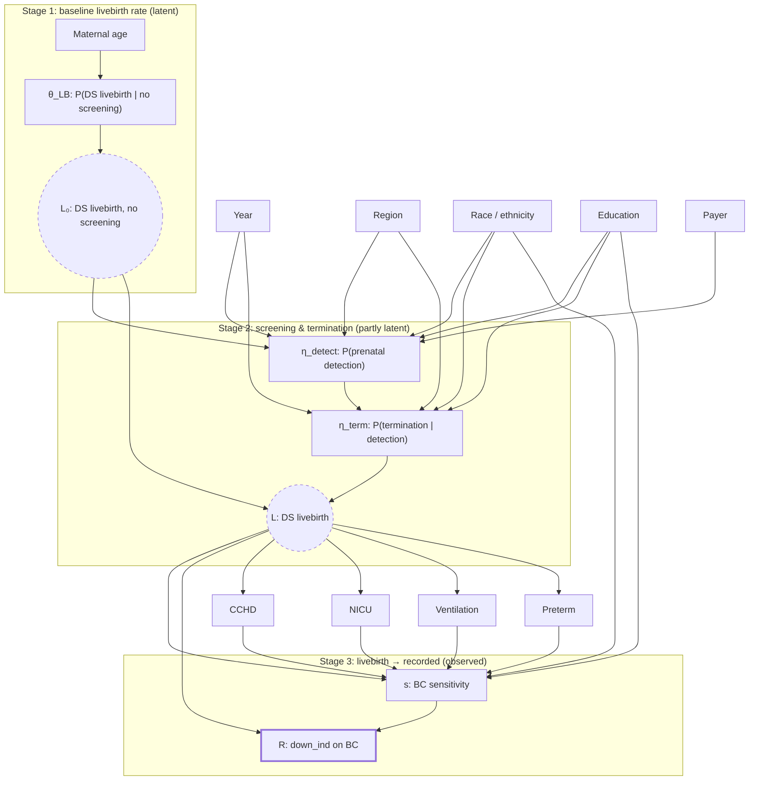

## Executive summary

US birth certificate data substantially under-records Down syndrome (DS) livebirths, typically capturing only about 40–50% of expected cases. Existing correction approaches — including gradient-boosting classifiers trained on the recorded-DS flag — have a structural problem: they learn the joint product of **whether a birth is DS** and **whether a DS birth was recorded**, and cannot separate the two. This matters because those two quantities depend on overlapping but distinct sets of demographic and clinical features.

This report proposes a **three-stage Bayesian selection model** that makes the generative process explicit. The model separates:

1. **Baseline livebirth prevalence** ($\theta_{\text{LB}}$), the DS livebirth rate that would obtain in the absence of prenatal screening and selective termination — an empirical quantity pinned by Morris et al.'s UK National Down Syndrome Cytogenetic Register data;
2. **Screening-and-termination pass-through** ($\eta$), decomposed into prenatal detection ($\eta_{\text{detect}}$) and termination given detection ($\eta_{\text{term}}$); and
3. **Birth-certificate sensitivity** ($s$), the probability that a DS livebirth is correctly flagged on the certificate.

Each component receives priors informed by specific published literatures: Morris et al.'s age-specific livebirth rates for $\theta_{\text{LB}}$; Natoli, Kuppermann and de Graaf et al. for $\eta_{\text{term}}$; Boulet et al. and Salemi et al. for $s$. Identification rests on the strength of those priors and on the clinical features that enter only $s$; the priors can be stress-tested by running the model under alternative assumptions.

The output is a posterior distribution over true DS livebirth counts by demographic cell, with honest uncertainty and explicit separation of under-recording from upstream selection. This is something the current classifier approach structurally cannot provide.

---

## 1. Background

### 1.1 The under-ascertainment problem

Down syndrome is one of seven congenital anomalies reported via checkbox on the US birth certificate, and birth certificates remain the principal national source of DS livebirth counts through NCHS natality files (CDC WONDER). The literature has been remarkably consistent since the 1970s that this recording is substantially incomplete.

A 1976 Minnesota study comparing birth certificates against cytogenetically confirmed cases found that roughly one third of confirmed DS cases had been recorded on the birth certificate. Huether et al. (1981) reported 33.9% statewide reporting in Ohio. Snell et al. (1992) reviewed the pre-1989 literature and found accuracy ranging from 12% to 100% across studies, with one large public hospital recording only 5.4% of detected anomalies.

The 1989 birth-certificate revision introduced checkboxes for specific anomalies. Watkins et al. (1996), validating the post-1989 form against the Metropolitan Atlanta Congenital Defects Program (MACDP), found overall sensitivity of about 28% for defects readily identifiable at birth, with DS among the less accurately reported. The 2003 revision restricted reporting to defects considered easily identifiable at birth, including DS.

Boulet et al. (2011) is the most detailed single validation study. Comparing 1995–2005 Georgia birth certificates against MACDP, overall sensitivity was 23% (7–69% across specific defects). Salemi et al. (2017) performed the analogous exercise for the 2003-revised certificate against the Florida Birth Defects Registry and reported that even after the redesign, birth certificates captured only about one in five infants with major defects. The authors recommended against using birth certificates as a standalone ascertainment source.

Egan et al. (2004, 2011) took a different approach: they used maternal-age-specific surveillance rates to back-calculate expected DS livebirth counts and compared with recorded counts. Over 1989–2006, they estimated that about 122,500 DS livebirths were expected against roughly 65,500 actually reported on birth certificates — implying capture of about 53%. This model-based estimate sits above the Boulet validation figure because it pools across defect types and incorporates demographic stratification that the Atlanta-only validation did not reach.

False positives are small by comparison. The Ohio/New York study found about 7.8% of birth-certificate-coded DS cases were not true cases on chart review, consistent with high specificity and low sensitivity. Birth certificates are a low-recall, high-precision instrument.

### 1.2 Biases in under-recording

A further finding that matters for modelling: the missing DS cases are **not missing completely at random**. Three sources of systematic variation are well-documented:

**Sociodemographic.** Boulet et al. found that non-Hispanic Black maternal race/ethnicity was independently associated with lower recording after adjustment (DS specifically: non-Hispanic Black and "other non-Hispanic" race/ethnicity associated with reduced sensitivity). Less-than-high-school maternal education was also independently associated with lower recording. Older ethnic-differences work (e.g., Bishop et al., AJPH 2000) raised the concern that differential recording across racial and ethnic groups could distort maternal-age risk estimates.

**Clinical.** Preterm birth was associated with lower sensitivity. The proposed mechanism is procedural: certificates are typically submitted within about five days of delivery, but preterm infants are more likely to be in a NICU with diagnostic workup (karyotype, echocardiogram) still pending. Cases eventually confirmed medically may never propagate back to the birth certificate.

**Hospital-level.** Counterintuitively, larger hospitals recorded worse than smaller ones. Boulet found sensitivity declining with hospital size; among hospitals with >2,500 mean annual births, sensitivity varied from roughly 1% to 58%. The explanations in the literature centre on multiple people of varying nosological expertise completing the form, NICU-level correlation with large hospitals, and certificate submission outrunning diagnostic confirmation.

Three structural implications follow. First, comparisons between demographic subgroups drawn from raw birth-certificate data are biased in ways that cannot be fixed by uniform rescaling. Second, trends over time can look artificially stable because the selection bias is itself stable. Third, validation studies (MACDP, Florida, New York) are regional and not straightforwardly generalisable to national-scale estimation.

### 1.3 Upstream selection: baseline rate, detection, and termination

The livebirth population is already a non-random subset of DS conceptions. Rather than separately modelling each upstream filter, we anchor the model on a well-measured external quantity: the DS livebirth rate that would obtain *in the absence of antenatal screening and termination*. This is what Morris, Mutton & Alberman (2002) estimated using the UK National Down Syndrome Cytogenetic Register (NDSCR), which combined postnatal DS cases with the small number of pregnancies that survived to delivery after prenatal diagnosis. Their logit-logistic curve supersedes the older Hook (1981) estimates, showing that the age-specific livebirth rate rises sigmoidally rather than exponentially, and that the rise attenuates above age 45. de Graaf, Buckley & Skotko's 2015 corrigendum to their EJHG paper provides age-banded numerical values derived from Morris's formula and is the most commonly-cited tabulation.

Two behavioural filters then reduce this baseline rate to the observed livebirth population:

**Prenatal detection.** Non-invasive prenatal testing (NIPT) became standard of care over 2012–2020 in the US, with ACOG recommending it for high-risk women in 2012 and for all women in 2020. Detection rates therefore rose substantially over the 2016–2024 window that concerns us. Uptake varies by payer, education, region, and access to maternal–fetal medicine specialists.

**Termination given detection.** Natoli et al. (2012) systematically reviewed US termination rates following a prenatal DS diagnosis and reported a weighted average around 67%, with substantial heterogeneity. Kuppermann et al. (2006) documented lower termination rates among non-Hispanic Black and Hispanic women and among younger mothers. de Graaf, Buckley & Skotko (2017) built these stages into a population-prevalence model and is the most usable single external reference for termination-rate priors.

A model that ignores this upstream selection and attributes all demographic variation in recorded DS rates to birth-certificate sensitivity will systematically misattribute termination-rate variation to recording variation — the two effects pull in the same direction for some groups (both decrease recorded counts among higher-education mothers) and opposite directions for others (non-Hispanic Black mothers are associated with *lower* sensitivity but *higher* livebirth pass-through due to lower termination).

---

## 2. Limitations of the classifier-based approach

The current working approach is a gradient-boosting (GB) model trained on `down_ind = 1`, used to rank non-recorded births and flag the top $C$ per year–month, where $C$ is the month's expected-less-recorded count. The attractive features of this approach are that it uses many signals and that the per-month anchoring to surveillance-derived expected counts gives approximate calibration of totals.

### 2.1 The selection-bias problem

The classifier's target is `recorded = 1`. Ignoring the small false-positive rate, this event is the logical conjunction of two things: the birth is DS, and the birth is recorded as DS given that it is DS. Therefore

$$
P(R = 1 \mid X) = P(R = 1 \mid \text{DS} = 1, X) \cdot P(\text{DS} = 1 \mid X) = s(X) \cdot \pi(X).
$$

A classifier trained on this target cannot separate $s(X)$ from $\pi(X)$. When ranking non-recorded births by the fitted score, the model prefers births that look like recorded DS cases — which is precisely the set selected *in favour of* by whatever biases affect $s(X)$. Boulet et al.'s finding that $s$ is lower for non-Hispanic Black mothers and lower-education mothers implies the classifier will *under*-flag exactly those groups among the non-recorded set, replicating the bias it was meant to correct.

This is consistent with the current report's most striking null result: the race/ethnicity and payer distributions of predicted-missing cases match the recorded distribution almost exactly, and education shows only a modest shift. If real under-ascertainment were differential in the way Boulet found, these distributions should *diverge* in predicted-missing relative to recorded. They don't, because the classifier has no way to disagree with the recorded-case profile.

### 2.2 Why "many signals" does not resolve this

The intuition that many signals should cancel out bias is correct for *omitted-variable* bias, which is fixed by adding covariates. Selection bias is structural: it is a property of the training data's sampling mechanism, and adding more features that correlate with the sampling mechanism *strengthens* the bias rather than correcting it. If maternal education predicts recording, and maternal education is a feature, the model learns to downweight low-education births — which is exactly the wrong direction.

Features that *do* help are those causally downstream of DS rather than of recording: CCHD, NICU admission, assisted ventilation. These are informative through mechanism (DS → clinical complexity) and do not route through the recording process. This is why the current report's CCHD, NICU, and ventilation signals are strong and correctly directed — they cut through the selection artefact where the demographic features cannot.

### 2.3 What the classifier gets right

The approach is not worthless. The per-month surveillance-anchored quota correctly calibrates total counts in aggregate. The clinical-feature signals provide real and validated DS detection on birth certificates where the diagnosis has not been flagged. A classifier that is aware only of clinical features (CCHD, NICU, ventilation, birth weight, gestational age, maternal age) reproduces most of the current model's useful signal with substantially less demographic contamination, and is a worthwhile diagnostic to run alongside the full model.

The structural limitation is that the classifier can only tell you about the observed joint $s \cdot \pi$. Any question about $\pi$ alone — e.g., "what is the true DS livebirth rate among NH Black mothers?" — requires a model that makes the decomposition explicit.

---

## 3. The Bayesian selection model: motivation

### 3.1 What "Bayesian" means here

Bayesian modelling is, at heart, a way of combining what you already know with what the data tell you. You specify (i) a **probability model** of how the observed data are generated — in our case, the three-stage process from baseline DS livebirth rate through screening/termination to recorded livebirth — and (ii) **priors**, which are probability distributions over the unknown parameters that encode what's already known (or suspected) about them from external evidence. The model then computes the **posterior** distribution over the parameters — the updated belief after observing the data — via Bayes' theorem:

$$
p(\text{parameters} \mid \text{data}) \propto p(\text{data} \mid \text{parameters}) \cdot p(\text{parameters}).
$$

Two properties make this approach particularly suitable here. First, it lets us inject the extensive validation literature (Boulet, Salemi, Natoli, de Graaf, etc.) directly into the model as priors on specific parameters, rather than applying ad-hoc corrections after the fact. Second, the posterior is a full distribution rather than a point estimate, so every downstream quantity — predicted true livebirth counts by demographic cell, relative under-ascertainment by race or education — comes with honest uncertainty.

In practice, the posterior is computed by simulation: an algorithm called **Markov Chain Monte Carlo** (MCMC; in PyMC, the specific variant is Hamiltonian Monte Carlo via the No-U-Turn Sampler) draws thousands of plausible parameter values from the posterior. Everything reported — means, credible intervals, subgroup contrasts — is a summary of those draws.

### 3.2 Why a structural model beats a correction factor

The alternative to a structural model is to apply an empirical sensitivity factor from Boulet or Salemi as a flat multiplier to recorded counts. This has three problems. The factor is an Atlanta or Florida estimate applied nationally. It collapses the known differential sensitivity across subgroups into a single number. And it does not address upstream selection at all.

A structural model with appropriate priors does the analogous thing for each stage separately, and the data can update each stage within the bounds of its prior. If Boulet's race-specific sensitivities are approximately right nationally, the posterior will stay close to them. If the data disagree — for example, if post-2003 electronic reporting has narrowed the differential — the posterior will move. The magnitude and direction of that movement is itself a finding.

---

## 4. Model specification

### 4.1 Three-stage generative structure

For each livebirth $i$ with covariates $X_i$, define three nested quantities:

$$
\begin{aligned}
L_{0,i} \mid X_i &\sim \text{Bernoulli}(\theta_{\text{LB},i}) && \text{(would-be DS livebirth in absence of screening)}\\
L_i \mid L_{0,i} = 1, X_i &\sim \text{Bernoulli}(\eta_i) && \text{(actual DS livebirth — i.e., not terminated)}\\
R_i \mid L_i = 1, X_i &\sim \text{Bernoulli}(s_i) && \text{(recorded on BC, given DS livebirth)}
\end{aligned}
$$

Only $R_i$ is directly observed for all births. $L_i$ is observed when $R_i = 1$ (modulo false positives) and latent when $R_i = 0$. $L_{0,i}$ is a counterfactual — the DS livebirth indicator that would have arisen in a world without prenatal screening — and is entirely latent.

Using a counterfactual quantity as the Stage 1 anchor is what lets the model simplify. The alternative — modelling DS at conception followed by separate natural loss, detection, and termination filters — would introduce an $\eta_{\text{loss}}$ parameter that is not identifiable from the observed data. Morris et al.'s NDSCR data directly measures the DS livebirth rate in the absence of screening, so we can treat $\theta_{\text{LB}}$ as pinned externally and let $\eta$ absorb only the screening-related filters that *do* vary across populations and over time.

### 4.2 Decomposing $\eta$

The pass-through rate is the probability that a DS pregnancy that would have produced a livebirth in the absence of screening *does* produce a livebirth despite the availability of screening. Writing detection and termination as sequential Bernoulli gates:

$$
\eta_i = 1 - \eta_i^{\text{detect}} \cdot \eta_i^{\text{term}}.
$$

The interpretation: a DS pregnancy becomes a livebirth if it is *not* (detected *and* terminated). If either detection fails or the family declines termination, the pregnancy reaches delivery.

This factorisation has two substantive advantages. It separates technology access ($\eta^{\text{detect}}$) from decision-making ($\eta^{\text{term}}$), and it allows the 2012–2020 NIPT rollout to load onto $\eta^{\text{detect}}$ without being conflated with termination rates.

### 4.3 Observed-data likelihood

The probability that a random livebirth is a DS livebirth is $\theta_{\text{LB},i} \cdot \eta_i$, which is very small (on the order of $10^{-3}$). Accounting for false positives $f$, the probability of recording is

$$
P(R_i = 1 \mid X_i) = \theta_{\text{LB},i} \cdot \eta_i \cdot s_i + (1 - \theta_{\text{LB},i} \cdot \eta_i) \cdot f.
$$

At the cell level (after aggregating individuals with identical covariates), the observation is a count $R_{\text{cell}}$ of recorded-DS births out of $N_{\text{cell}}$ total livebirths, distributed

$$
R_{\text{cell}} \sim \text{Binomial}\bigl(N_{\text{cell}}, \; \theta_{\text{LB},\text{cell}} \, \eta_{\text{cell}} \, s_{\text{cell}} + (1 - \theta_{\text{LB},\text{cell}} \, \eta_{\text{cell}}) f\bigr).
$$

### 4.4 Regression structure

Each stage's parameter is modelled as a logistic function of covariates:

**Baseline livebirth rate** depends only on maternal age:
$$
\text{logit}(\theta_{\text{LB}}) = f_{\text{Morris}}(\text{age}).
$$

**Detection** depends on year (NIPT rollout), maternal age, education, payer, and region:
$$
\text{logit}(\eta^{\text{detect}}) = \beta_0^{\text{det}} + g^{\text{det}}(\text{year}) + h^{\text{det}}(\text{age}) + \gamma^{\text{det}}_{\text{race}} + \gamma^{\text{det}}_{\text{edu}} + \gamma^{\text{det}}_{\text{payer}} + \gamma^{\text{det}}_{\text{region}}.
$$

**Termination given detection** depends on race, education, and year (year enters as a residual-drift term, with a single homoscedastic sigma):
$$
\text{logit}(\eta^{\text{term}}) = \beta_0^{\text{term}} + \gamma^{\text{term}}_{\text{race}} + \gamma^{\text{term}}_{\text{edu}} + \gamma^{\text{term}}_{\text{year}}.
$$

**Sensitivity** depends on race, education, preterm status, CCHD, NICU, and assisted ventilation:
$$
\text{logit}(s) = \zeta_0 + \zeta_{\text{race}} + \zeta_{\text{edu}} + \zeta_{\text{preterm}} \cdot \text{preterm} + \zeta_{\text{cchd}} \cdot \text{cchd} + \zeta_{\text{nicu}} \cdot \text{nicu} + \zeta_{\text{aven}} \cdot \text{aven}.
$$

The key modelling discipline is which covariates appear where. Clinical features observed *at birth* (CCHD, NICU, ventilation, preterm) enter only $s$, never $\eta$ or $\theta_{\text{LB}}$, because they are measured after the pregnancy filters and cannot causally influence them. Demographic features (race, education, payer) may enter $\eta^{\text{detect}}$, $\eta^{\text{term}}$, and $s$ — the decomposition is made possible by the *priors* on each component, not by feature exclusion.

---

## 5. Directed acyclic graph

The model's structure is shown below. Latent nodes (unobserved) are marked with dashed borders; the observed outcome $R$ is solid.



The key reading of the DAG:

- **Maternal age** enters at Stage 1 via Morris's logit-logistic curve, pinning $\theta_{\text{LB}}$ as a function of age.
- **Demographic covariates** (race, education, payer, region) enter at Stages 2 and 3 but *not* Stage 1. This is a substantive modelling claim: the DS livebirth rate in the absence of screening does not depend meaningfully on race or education once maternal age is controlled. Any apparent demographic signal in baseline rates reflects downstream filters.
- **Clinical covariates observed at birth** (CCHD, NICU, ventilation, preterm) enter only $s$ and arise downstream of $L$. They inform recording sensitivity because NICU workups delay DS confirmation past certificate submission; they cannot causally influence the screening/termination stage.
- **Year** enters $\eta^{\text{detect}}$ (capturing the NIPT rollout) and $\eta^{\text{term}}$ (as a residual drift term with a tight sigma).

---

## 6. Priors: where external evidence enters

The model is structurally under-identified — for any given observed $R$, one could explain it with higher $\theta \eta$ and lower $s$, or vice versa. The priors close this by anchoring each stage to the evidence base most relevant to it.

### 6.1 Baseline livebirth rate $\theta_{\text{LB}}$

Morris, Mutton & Alberman (2002) revised the earlier Hook (1981) maternal-age risk estimates using the UK National Down Syndrome Cytogenetic Register (1989–1998), which remains the largest single dataset of karyotypically confirmed DS cases. Their key empirical finding was that the age-specific livebirth rate follows a logit-logistic rather than exponential form, and that the rate of increase attenuates above age 45 rather than continuing to rise as Hook's extrapolation suggested.

de Graaf, Buckley & Skotko (2015, corrigendum to EJHG 2011) provide the commonly-cited age-banded values derived from Morris's formula, in units of DS livebirths per 1,000 livebirths in the absence of screening:

| Maternal age | Morris / de Graaf livebirth rate per 1,000 |
|:---|---:|
| <20 | 0.66 |
| 20–24 | 0.70 |
| 25–29 | 0.84 |
| 30–34 | 1.48 |
| 35–39 | 4.72 |
| 40–44 | 15.22 |
| 45+ | 30.71 |

Prior specification on the logit scale: $f_{\text{Morris}}(\text{age}_k) \sim \mathcal{N}(\text{logit}(\hat\theta_k), 0.1)$. The tight standard deviation reflects the strength of the biological and demographic evidence — this is the part of the model that is most firmly known and should not be flexed by the data, since doing so would absorb variation that properly belongs in $\eta$ or $s$.

Note on interpretation: Morris's values are empirical livebirth rates in the absence of antenatal screening, derived from NDSCR data spanning a period before NIPT and with mixed screening uptake. They *include* natural fetal loss from the detection window to delivery, so no separate natural-loss parameter is needed. This is what makes the three-stage simplification possible.

### 6.2 Detection $\eta^{\text{detect}}$

This is the most time-varying component of the model. NIPT uptake was approximately:

- Pre-2012: combined first-trimester screening only, detection sensitivity ~85% conditional on uptake; uptake ~50–70%
- 2012–2020: NIPT available for high-risk women, detection sensitivity ~99% conditional on uptake; uptake rising
- Post-2020: NIPT recommended for all women; uptake continues to rise

By the 2016–2024 window of interest, $\eta^{\text{detect}}$ conditional on any screening has been high, but access-to-screening varies substantially. For a baseline prior: $\beta_0^{\text{det}} \sim \mathcal{N}(\text{logit}(0.70), 0.3)$ with year effects $g^{\text{det}}(\text{year}) \sim \mathcal{N}(0, 0.3)$ capturing the rollout.

Demographic priors on $\gamma^{\text{det}}$ follow the access-to-screening literature. Non-Hispanic Black and Hispanic mothers, lower-education mothers, Medicaid patients, and mothers in rural regions have lower access and therefore lower $\eta^{\text{detect}}$. Priors centred on log-odds effects of approximately −0.2 to −0.3 for these groups, with sigma 0.2.

### 6.3 Termination given detection $\eta^{\text{term}}$

Natoli et al. (2012) provides the central anchor: weighted average US termination rate of 67% following prenatal DS diagnosis, based on studies from 1995–2011. Kuppermann et al. (2006) provides demographic decomposition — lower termination among non-Hispanic Black and Hispanic women, lower among younger mothers, lower in regions with restrictive abortion access. de Graaf et al. (2017) synthesises these for their US population-prevalence model.

Priors: $\beta_0^{\text{term}} \sim \mathcal{N}(\text{logit}(0.67), 0.25)$. Race effects: $\gamma^{\text{term}}_{\text{NH Black}} \sim \mathcal{N}(-0.7, 0.2)$, $\gamma^{\text{term}}_{\text{Hispanic}} \sim \mathcal{N}(-0.4, 0.2)$, $\gamma^{\text{term}}_{\text{NH White}} = 0$ (reference). Education effects similarly negative for lower education. A single homoscedastic year term $\gamma^{\text{term}}_{\text{year}} \sim \mathcal{N}(0, 0.15)$ absorbs residual year-over-year drift around the Natoli anchor; year coefficients are expected to be small since conditional termination rates have been approximately stable over the 2016–2024 window.

### 6.4 Birth-certificate sensitivity $s$

The DS-specific intercept is anchored around 40% (midway between Boulet's 23% for combined defects and Egan's 53% back-calculated figure, acknowledging that DS is better-recorded than some defects but worse than anencephaly): $\zeta_0 \sim \mathcal{N}(\text{logit}(0.40), 0.3)$.

Boulet-derived race effects: $\zeta_{\text{NH Black}} \sim \mathcal{N}(-0.4, 0.25)$ (lower sensitivity), $\zeta_{\text{NH White}} = 0$. Education effects: $\zeta_{<\text{HS}} \sim \mathcal{N}(-0.3, 0.2)$. Preterm effect: $\zeta_{\text{preterm}} \sim \mathcal{N}(-0.4, 0.2)$.

CCHD, NICU, and ventilation effects are less directly supported in the validation literature but follow the same mechanism (delayed workup). Priors: $\zeta_{\text{cchd}} \sim \mathcal{N}(-0.5, 0.4)$, $\zeta_{\text{nicu}} \sim \mathcal{N}(-0.5, 0.4)$, $\zeta_{\text{aven}} \sim \mathcal{N}(-0.4, 0.4)$. The wide priors acknowledge that the existing analysis may update these substantially.

### 6.5 False-positive rate

Fixed at $f = 7.8 \times 10^{-5}$ per livebirth, calibrated to produce approximately the 7.8% false-positive share in recorded cases reported by the Ohio/NY study, given the overall recorded rate. Alternatively, $f$ can be estimated with a very tight prior if sensitivity analysis is desired.

---

## 7. Identification: what the data can and cannot separate

The model's identifiability — whether the data can pin down each parameter — depends on which contrasts in the observed $R$ the parameters exploit.

### 7.1 Age effects are well-identified

Because $\theta_{\text{LB}}$ is pinned tightly to Morris, the age variation in recorded-DS rates is partitioned between $\eta^{\text{detect}}$, $\eta^{\text{term}}$, and (with very weak dependence per Boulet) $s$. The model can fit observed age patterns well, and posterior uncertainty on age-specific livebirth rates should be modest.

### 7.2 Race effects are prior-dependent

For race, the literature gives *opposing* expected effects: non-Hispanic Black mothers have lower $\eta^{\text{term}}$ (fewer terminations, more livebirths) and lower $s$ (worse recording). These pull observed $R$ in opposite directions. The model can separate them only to the extent that the priors are informative.

The risk is that the posterior partitions the joint demographic effect between $\eta^{\text{term}}$ and $s$ roughly in proportion to the prior precisions, without the data contributing much. That is a real limitation. It means race-specific posterior estimates should be read as *consistent with* the external literatures, not *derived from the national data*.

### 7.3 The NIPT rollout as a year-dimension signal for detection

The 2012–2020 NIPT rollout provides a year-dimension signal for $\eta^{\text{detect}}$. For the 2016–2024 window this is mostly the tail of the rollout, but year effects on detection should still be visible. Termination-rate priors are assumed stable over the window (single tight year sigma), which means year variation in the recorded rate that is not attributable to cohort age or clinical-marker composition is allocated primarily to $\eta^{\text{detect}}$.

### 7.4 CCHD, NICU, ventilation identify $s$ separately

The clinical features are the cleanest part of the identification. They are informative about DS status (causally downstream of DS) and about sensitivity (delayed workup mechanism), and they enter *only* $s$. Two cells with identical demographics but different CCHD rates should differ in $s$ but not $\eta$ — this is what lets the model distinguish "this cell has low recorded rate because sensitivity is low" from "this cell has low recorded rate because termination rate is high".

---

## 8. Sensitivity analyses

Because identification depends heavily on the priors for race and education effects, a principled sensitivity analysis is essential. The recommended structure:

**Variant A — informative $s$ priors, weak $\eta^{\text{term}}$ priors.** Boulet/Salemi priors on $s$ at published precision; $\gamma^{\text{term}}$ priors shrunk toward zero with wide sigma. This is the "sensitivity drives the observed differential" version.

**Variant B — informative $\eta^{\text{term}}$ priors, weak $s$ priors.** Natoli/Kuppermann/de Graaf priors on $\eta^{\text{term}}$ at published precision; $\zeta$ race and education priors shrunk toward zero. The "termination variation drives the observed differential" version.

**Variant C — both informative.** The main specification.

Reporting discipline: if the three variants (A, B, C) give materially different race-specific posterior estimates for $\eta^{\text{term}}$ and $s$ individually, but similar estimates for the *compound quantity* $\theta \eta s$ (which is what the data constrain), then the data cannot cleanly decompose the demographic effects and the honest reporting is the compound rate plus sensitivity bounds on the decomposition. If they agree, that is evidence the decomposition is data-supported and can be reported with confidence.

---

## 9. Expected outputs and interpretation

The model's posterior gives the following quantities, each with full uncertainty:

**True DS livebirth counts per demographic cell** (marginalised over $R$). This is the principal quantity of interest and improves on the current predicted-missing set by not being ranked against the biased target. Counts can be aggregated to any level — year, region, race, race × region, etc. — from the joint posterior.

**Decomposition of observed under-ascertainment.** For any demographic contrast, the model returns the fraction of the apparent recording gap attributable to each of: natural loss ($\eta^{\text{loss}}$), lower detection ($\eta^{\text{detect}}$), lower termination-given-detection ($\eta^{\text{term}}$), and lower BC sensitivity ($s$). This is the finding that the classifier approach structurally cannot produce.

**CCHD co-occurrence in true DS livebirths.** The Heinke et al. (2021) and EUROCAT estimates put true DS × CCHD co-occurrence around 20–25% (for cyanotic lesions specifically). The current birth-certificate data shows ~6% co-occurrence among recorded DS cases. The Bayesian model posterior should recover the ~20–25% figure after correcting for under-ascertainment, providing an internal consistency check.

**Subgroup-specific sensitivity estimates.** $s$ by race, education, and preterm status, updated from Boulet's Atlanta-1995–2005 figures by the 2016–2024 national data. These are themselves publishable findings — either confirming Boulet's differential, or documenting its narrowing under electronic reporting.

---

## References

Bekker, J. & Davis, J. (2020). Learning from positive and unlabeled data: A survey. *Machine Learning*, 109(4), 719–760.

Bishop, J., Huether, C. A., Torfs, C., Lorey, F. & Deddens, J. (2000). Epidemiologic study of Down syndrome in a racially diverse California population, 1989–1991. *American Journal of Public Health*, 90(11), 1778–1784.

Boulet, S. L., Shin, M., Kirby, R. S., Goodman, D. & Correa, A. (2011). Sensitivity of birth certificate reports of birth defects in Atlanta, 1995–2005: Effects of maternal, infant, and hospital characteristics. *Public Health Reports*, 126(2), 186–194.

Cuckle, H. (2021). Maternal age in the epidemiology of common autosomal trisomies. *Prenatal Diagnosis*, 41(5), 621–629.

de Graaf, G., Buckley, F. & Skotko, B. G. (2011). Estimates of the live births, natural losses, and elective terminations with Down syndrome in the United States. *American Journal of Medical Genetics Part A*, 167A(4), 756–767.

de Graaf, G., Buckley, F. & Skotko, B. G. (2015). Erratum: Trends in maternal age distribution and the live birth prevalence of Down's syndrome in England and Wales: 1938–2010. *European Journal of Human Genetics*, 23(8), 1140. [Corrigendum providing age-banded livebirth rates from Morris's formula.]

de Graaf, G., Buckley, F. & Skotko, B. G. (2017). Estimation of the number of people with Down syndrome in the United States. *Genetics in Medicine*, 19(4), 439–447.

Egan, J. F., Benn, P. A., Zelop, C. M., Bolnick, A., Gianferrari, E. & Borgida, A. F. (2004). Down syndrome births in the United States from 1989 to 2001. *American Journal of Obstetrics and Gynecology*, 191(3), 1044–1048.

Egan, J. F. X., Smith, K., Timms, D., Bolnick, J. M., Campbell, W. A. & Benn, P. A. (2011). Demographic differences in Down syndrome livebirths in the US from 1989 to 2006. *Prenatal Diagnosis*, 31(4), 389–394.

Elkan, C. & Noto, K. (2008). Learning classifiers from only positive and unlabeled data. In *Proceedings of the 14th ACM SIGKDD International Conference on Knowledge Discovery and Data Mining*, 213–220.

Heinke, D., Isenburg, J. L., Stallings, E. B., Short, T. D., Le, M., Fisher, S., et al. (2021). Prevalence of structural birth defects among infants with Down syndrome, 2013–2017: A US population-based study. *Birth Defects Research*, 113(2), 91–97.

Hexter, A. C., Harris, J. A., Roeper, P., Croen, L. A., Krueger, P. & Gant, D. (1990). Evaluation of the hospital discharge diagnoses index and the birth certificate as sources of information on birth defects. *Public Health Reports*, 105(3), 296–307.

Hook, E. B. (1981). Rates of chromosome abnormalities at different maternal ages. *Obstetrics and Gynecology*, 58(3), 282–285. [Superseded by Morris et al. 2002 but cited for historical context.]

Huether, C. A., Gummere, G. R., Hook, E. B., Dignan, P. S., Volodkevich, H., Barg, M., et al. (1981). Down's syndrome: Percentage reporting on birth certificates and single year maternal age risk rates for Ohio 1970–79. *American Journal of Medical Genetics*, 8(4), 427–439.

Kuppermann, M., Learman, L. A., Gates, E., Gregorich, S. E., Nease, R. F., Lewis, J. & Washington, A. E. (2006). Beyond race or ethnicity and socioeconomic status: Predictors of prenatal testing for Down syndrome. *Obstetrics and Gynecology*, 107(5), 1087–1097.

Morris, J. K., Mutton, D. E. & Alberman, E. (1999). Revised estimates of the maternal age specific live birth prevalence of Down's syndrome. *Journal of Medical Screening*, 6(4), 192–195.

Morris, J. K., Mutton, D. E. & Alberman, E. (2002). Revised estimates of the maternal age specific live birth prevalence of Down's syndrome. *Journal of Medical Screening*, 9(1), 2–6. [Primary reference for $\theta_{\text{LB}}$ age curve; supersedes Hook 1981.]

Natoli, J. L., Ackerman, D. L., McDermott, S. & Edwards, J. G. (2012). Prenatal diagnosis of Down syndrome: A systematic review of termination rates (1995–2011). *Prenatal Diagnosis*, 32(2), 142–153.

Salemi, J. L., Tanner, J. P., Sampat, D. P., Rutkowski, R. E., Anjohrin, S. B., Marshall, J. & Kirby, R. S. (2017). Evaluation of the sensitivity and accuracy of birth defects indicators on the 2003 revision of the US birth certificate: Has data quality improved? *Paediatric and Perinatal Epidemiology*, 31(1), 67–75.

Savva, G. M., Morris, J. K., Mutton, D. E. & Alberman, E. (2006). Maternal age-specific fetal loss rates in Down syndrome pregnancies. *Prenatal Diagnosis*, 26(6), 499–504.

Snell, L. M., Little, B. B., Knoll, K. A., Johnston, W. L., Rosenfeld, C. R. & Gant, N. F. (1992). Reliability of birth certificate reporting of congenital anomalies. *American Journal of Perinatology*, 9(3), 219–222.

Wang, Y., Sharpe-Stimac, M., Cross, P. K., Druschel, C. M. & Hwang, S. A. (2005). Improving case ascertainment of a population-based birth defects registry in New York State using hospital discharge data. *Birth Defects Research Part A: Clinical and Molecular Teratology*, 73(10), 663–668.

Watkins, M. L., Edmonds, L., McClearn, A., Mullins, L., Mulinare, J. & Khoury, M. (1996). The surveillance of birth defects: The usefulness of the revised US standard birth certificate. *American Journal of Public Health*, 86(5), 731–734.

---

## Annex A: PyMC implementation plan

This annex sketches an implementation path for the model in PyMC. It is organised as a sequence of staged builds, each a runnable model that exposes specific behaviour, rather than a single monolithic implementation.

### A.1 Data preparation

Input data: NCHS natality files for 2016–2024. For each birth, extract the covariates used in the model and `down_ind`.

Aggregate to cells indexed by:
- `year` (2016–2024): 9 levels
- `age_group`: <20, 20–24, 25–29, 30–34, 35–39, 40–44, 45+ (7 levels)
- `race`: NH White, NH Black, NH Asian, NH AIAN/NHOPI/Other, Hispanic, Unknown (6 levels)
- `education`: <HS, HS/GED, some college, BA, MA+, Unknown (6 levels)
- `payer`: Medicaid, private, self-pay/other, Unknown (4 levels)
- `preterm`: <37 weeks vs ≥37 weeks (2 levels)
- `cchd`: yes/no (2 levels)
- `nicu`: yes/no (2 levels)
- `aven`: yes/no (2 levels)

Full cross over these seven factors and four clinical flags gives a cell count in the tens of thousands; observed real-data cell counts sit around 60,000 for the 2016–2024 window.

For each cell, compute $N_{\text{cell}}$ (total livebirths) and $R_{\text{cell}}$ (recorded DS). Store as a pandas DataFrame with integer-coded factor levels.

### A.2 Core model in PyMC

A sketch of the central model specification:

```python
import pymc as pm
import numpy as np
import pytensor.tensor as pt

# Load cell-level data into arrays
# age_idx, race_idx, edu_idx, payer_idx, year_idx,
# preterm, cchd, nicu, aven, N_cell, R_cell

def logit(p):
    return np.log(p / (1 - p))

with pm.Model() as ds_model:
    # ------------------------------------------------------------------
    # Stage 1: baseline DS livebirth rate (theta_LB), tightly pinned
    # by Morris / de Graaf 2015 age-specific values (per-1000 livebirths
    # in absence of screening)
    # ------------------------------------------------------------------
    morris_logit = logit(np.array([
        0.00066,  # <20
        0.00070,  # 20-24
        0.00084,  # 25-29
        0.00148,  # 30-34
        0.00472,  # 35-39
        0.01522,  # 40-44
        0.03071,  # 45+
    ]))
    theta_lb_age = pm.Normal("theta_lb_age", mu=morris_logit, sigma=0.1,
                             shape=N_AGE)

    # ------------------------------------------------------------------
    # Stage 2a: detection (eta_detect)
    # ------------------------------------------------------------------
    eta_det_intercept = pm.Normal("eta_det_int",
                                  mu=logit(0.70), sigma=0.3)
    eta_det_year = pm.Normal("eta_det_year", mu=0, sigma=0.3,
                             shape=N_YEAR)
    eta_det_age = pm.Normal("eta_det_age", mu=0, sigma=0.2,
                            shape=N_AGE)
    eta_det_race = pm.Normal("eta_det_race",
                             mu=np.array([0, -0.30, -0.40, -0.10, -0.25, 0]),
                             sigma=0.2, shape=N_RACE)
    eta_det_edu = pm.Normal("eta_det_edu",
                            mu=np.array([-0.45, -0.20, 0, 0.15, 0.25, 0]),
                            sigma=0.2, shape=N_EDU)
    eta_det_payer = pm.Normal("eta_det_payer",
                              mu=np.array([-0.20, 0, -0.15, 0]),
                              sigma=0.2, shape=N_PAYER)

    # ------------------------------------------------------------------
    # Stage 2b: termination given detection (eta_term)
    # ------------------------------------------------------------------
    eta_term_intercept = pm.Normal("eta_term_int",
                                   mu=logit(0.67), sigma=0.25)
    eta_term_race = pm.Normal("eta_term_race",
                              mu=np.array([0, -0.70, -0.30, -0.15, -0.40, 0]),
                              sigma=0.2, shape=N_RACE)
    eta_term_edu = pm.Normal("eta_term_edu",
                             mu=np.array([-0.30, -0.10, 0, 0.10, 0.20, 0]),
                             sigma=0.2, shape=N_EDU)
    # Homoscedastic year effect absorbing residual drift in termination.
    eta_term_year = pm.Normal("eta_term_year", mu=0, sigma=0.15,
                              shape=N_YEAR)

    # ------------------------------------------------------------------
    # Stage 3: BC sensitivity (s)
    # ------------------------------------------------------------------
    s_intercept = pm.Normal("s_int", mu=logit(0.40), sigma=0.3)
    s_race = pm.Normal("s_race",
                       mu=np.array([0, -0.40, -0.30, -0.10, -0.20, 0]),
                       sigma=0.25, shape=N_RACE)
    s_edu = pm.Normal("s_edu",
                      mu=np.array([-0.30, -0.10, 0, 0.10, 0.20, 0]),
                      sigma=0.2, shape=N_EDU)
    s_preterm = pm.Normal("s_preterm", mu=-0.40, sigma=0.20)
    s_cchd = pm.Normal("s_cchd", mu=-0.50, sigma=0.40)
    s_nicu = pm.Normal("s_nicu", mu=-0.50, sigma=0.40)
    s_aven = pm.Normal("s_aven", mu=-0.40, sigma=0.40)

    # ------------------------------------------------------------------
    # Assemble per-cell probabilities
    # ------------------------------------------------------------------
    theta_lb = pm.math.invlogit(theta_lb_age[age_idx])

    eta_detect = pm.math.invlogit(
        eta_det_intercept + eta_det_year[year_idx]
        + eta_det_age[age_idx] + eta_det_race[race_idx]
        + eta_det_edu[edu_idx] + eta_det_payer[payer_idx]
    )

    eta_term = pm.math.invlogit(
        eta_term_intercept + eta_term_race[race_idx]
        + eta_term_edu[edu_idx] + eta_term_year[year_idx]
    )

    # Pass-through: a pregnancy becomes a livebirth if it is NOT
    # (detected AND terminated).
    eta = 1 - eta_detect * eta_term

    s = pm.math.invlogit(
        s_intercept + s_race[race_idx] + s_edu[edu_idx]
        + s_preterm * preterm + s_cchd * cchd
        + s_nicu * nicu + s_aven * aven
    )

    # ------------------------------------------------------------------
    # Observed-data likelihood
    # ------------------------------------------------------------------
    p_ds_lb = theta_lb * eta  # P(DS livebirth | livebirth)
    f_fp = 7.8e-5
    p_recorded = p_ds_lb * s + (1 - p_ds_lb) * f_fp

    R_obs = pm.Binomial("R_obs", n=N_cell, p=p_recorded,
                        observed=R_cell)
```

### A.3 Staged model builds

Do not attempt to fit the full model first. Build up:

1. **Stage A — θ_LB only.** Fix $\eta = 1$ and $s = 1$; check that the Morris curve prior reproduces approximately the observed recorded-DS age pattern scaled by a constant factor (which will be $\bar\eta \bar s$, around 0.4 in the 2016–2024 window). This is a sanity check that the age-coding and cell construction are correct.

2. **Stage B — θ_LB and s.** Add sensitivity without the screening filter. Check that posterior $s$ estimates by race and education approximately recover Boulet directions.

3. **Stage C — three-stage with single $\eta$.** Add the pass-through component without the detection/termination split. Check that posterior $\eta$ is somewhere near Egan's 50–55% figure in aggregate.

4. **Stage D — full model with $\eta^{\text{detect}} \cdot \eta^{\text{term}}$ split.** The final model. Check that NIPT year effects are recovered for $\eta^{\text{detect}}$ and that the total recorded-DS rate is well-calibrated in aggregate and by cell.

### A.4 Sampling

Start with NUTS, 4 chains of 2,000 draws + 1,000 warmup. On the 2016–2024 aggregation (~60k cells), expect sampling to take a few hours on a modern workstation. Monitor $\hat R$ and effective sample sizes; expect some difficulty where cells are sparse.

If sampling is slow or poorly mixing, two remedies:
- **Reparameterise hierarchical effects non-centrally.** Replace `pm.Normal("x", mu=mu, sigma=sigma)` with `pm.Normal("x_raw", 0, 1)` and `x = mu + sigma * x_raw`.
- **Reduce the model.** Drop one of the clinical features or coarsen education.

For very large cell counts, consider **variational inference** via `pm.fit(..., method='advi')` as a fast diagnostic, but rely on NUTS for final results.

### A.5 Posterior summaries

Key quantities to extract:

- **True DS livebirth count per cell.** Posterior predictive on $N_{\text{cell}} \cdot \theta_{\text{cell}} \cdot \eta_{\text{cell}}$. Aggregate to desired levels.
- **Sensitivity by subgroup.** Posterior on `invlogit(s_int + s_race[k])` for each race.
- **Termination-rate posterior** by race and education.
- **Detection-rate posterior** by year, demonstrating the NIPT rollout.
- **Compound under-ascertainment ratio** by cell: (expected DS livebirths) / (recorded DS livebirths). Compare to current classifier outputs.

Report all subgroup quantities with 50% and 95% credible intervals. The width of these intervals will itself be informative about which contrasts are well-identified.

### A.6 Sensitivity analysis protocol

Run the full model three times:

- **Variant A:** Tight $s$ priors (sigma halved), weak $\eta^{\text{term}}$ priors (sigma doubled).
- **Variant B:** Tight $\eta^{\text{term}}$ priors, weak $s$ priors.
- **Variant C:** All priors at default (main specification).

Compare posterior race and education effects across variants. Report the main results from Variant C, with the range across variants as the effective uncertainty.

### A.7 Validation against registry data

If access can be arranged, validate the model's state-level predicted DS livebirth counts against one or more state birth-defects registries (Florida, New York, Texas). Expected outcome: registry-identified counts should fall within the model's 95% credible interval for states where the registry has active case-finding with high coverage. Substantial systematic deviation would indicate that either the priors need revisiting or the model is missing a structural component.

### A.8 Diagnostic plots

At minimum:
- Posterior predictive checks on recorded counts by year, by race, by age group.
- Pair plots of the race effects in $\eta^{\text{term}}$ vs $s$ (to diagnose the identifiability issue directly — strong negative correlation in the posterior indicates that the data cannot separate them and priors are doing the work).
- Compound sensitivity × detection × termination plots showing the decomposition of each demographic contrast.

The identifiability pair-plots are the single most important diagnostic. If race effects in $\eta^{\text{term}}$ and $s$ have posterior correlation below about −0.7, the separation is genuinely prior-driven and should be reported as such.

---

*End of report.*
